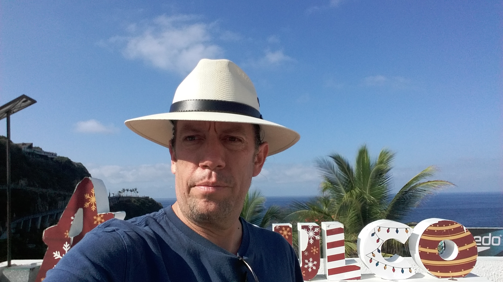
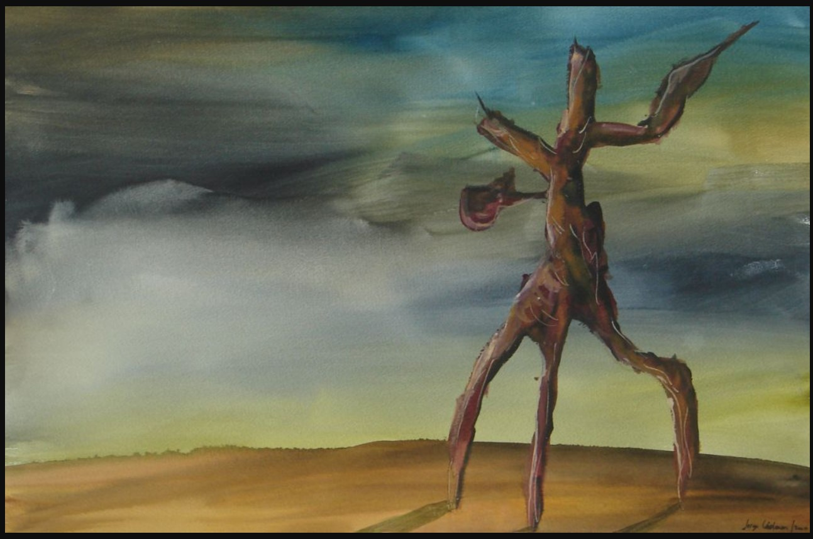
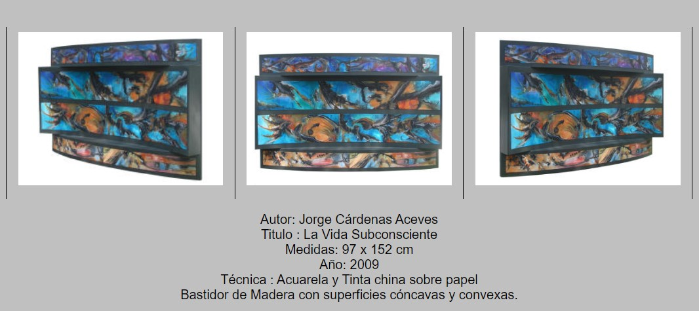
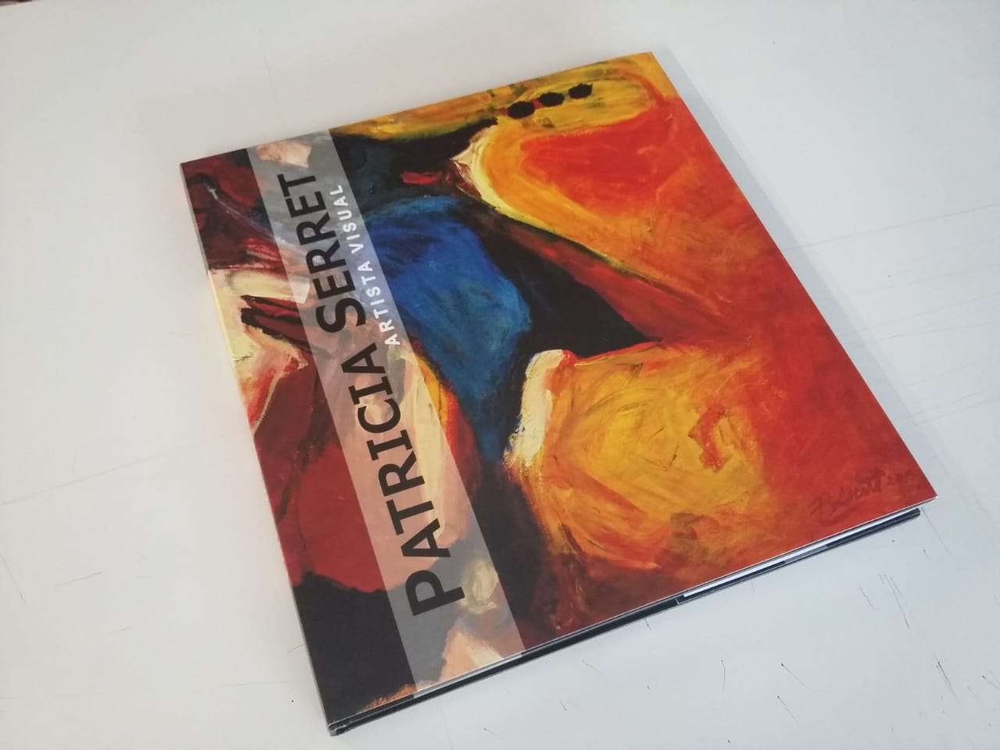
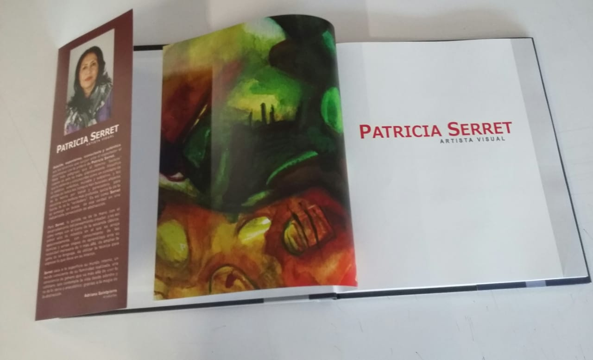

Jorge is my twin brother. We are the youngest in a family of three brothers and 2 sisters. He has been and is so important in my life that I even dedicated an entire episode of my podcast “De regalos y palabras” (Of Gifts and Words) to him.

I love him with all my heart and admire him deeply.

He has always been an example of a pure heart and has taught me to use art to express both pain and joy.

As the creator of [Pintores Mexicanos](https://www.pintoresmexicanos.com/) he inspires me to keep creating and sharing the creations of others.

Here are 10 questions I asked him so you can get to know him better:

***1. How would you describe yourself?***

I am noble, calm, persevering, curious.

***2. What do you want from life?***

Love and peace.
  
***3. Why do you do the things you do?***

Because I think I should do it for my good and the common good.
  
***4. How do you understand the process of "what if I say yes?"***

I think it's like opening a door, you're always going to encounter surprises.
  
***5. What would you say was your first "what if I say yes" moment?***

I guess when I was a child, and my parents asked me if I wanted to take judo classes and I said yes.

***6. Describe your most recent "what if I say yes?" moment.***

When I decided to design art books. I was very hesitant to do the first one in offset printing because it represented a great responsibility, but I finally decided to do it and it was a complete success. And from there, I started designing and printing more books for other artists.

***7. What things have you created in your life after saying "what if I say yes?" Make a list.***

Well, regarding the sports I did, I always said yes to all of them: roller skating, soccer, ping pong, water skiing, snow skiing, ice skating, football, basketball, squash, swimming, yoga, tai chi, chi kung, Olympic gymnastics, roller hockey and ice hockey, tennis and fronton.

Also, my neighbor invited me to take painting classes, and I said yes, and from there thousands of amazing paintings emerged that came out of me that I never thought I would do. I even won 1st place in a professional watercolor contest and painting became my second profession.

***8. How have others reacted to your “what if I say yes?” process?***

Always supporting me.
  
***9. What will be your next “what if I say yes” moment?***

I want to visit New York City again.

***10. What have you learned from the "what if I say yes" process?***

That the mind imagines many negative things before we make a decision, but in reality, life has always surprised me with good things, mostly, and some bad.

And that you must have the courage to take the step and walk through the door and experience life.

You can find Jorge at:

[Facebook](https://www.facebook.com/jorge.cardenas.aceves)

[Pintores Mexicanos](https://www.pintoresmexicanos.com/jorgec/)

