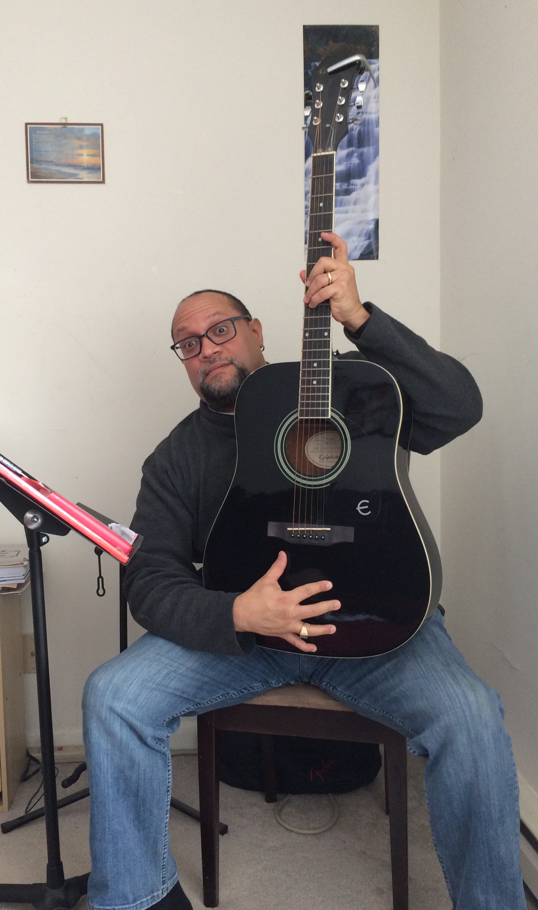

Carlos is my dear husband and the love of my life.

A lot of people know him, but only a few know how interesting and varied his life experiences have been.

He comes from a humble background and has forged a beautiful life for himself out of resilience and an endless curiosity for learning about politics, religion, spirituality, sports, comedy, humor, writing, music, poetry, etc.

Here are 10 questions I asked him, so you can get to know him better:

***1. How would you describe yourself?***

I am fair, curious, quick-witted, sarcastic, kind, and empathetic. But mostly, I am a good listener… when I have time. (I did it again, sorry!)

***2. What do you want out of life?***

I want life to be kind to me as I grow older and hopefully wiser.

***3. Why do you do the things you do?***

I do many things great and small. So, I would say I do these things for several reasons:

1) so I can learn something new. I am never afraid of trying something new, well within reason; must be legal and family-friendly. I believe in learning new things (e.g., playing guitar, reading political-economic theory, doing some historical writing, cooking with a Wok, singing or rapping, finger painting, writing poetry, or even cutting up red meat at a butcher shop) while doing it the best I can if ever possible;

2) so I can surprise myself that I can actually do the thing I set out to do no matter how long it takes me (e.g. pursuing and finishing a Ph.D. degree, and getting tenure at a college);

3) so I can bring a smile to someone's face, for example, my lovely and dear Mami (who passed in 2015), providing a generous gesture, a helping hand that aids in transforming a life (human or otherwise) if only for a second, for the better;

4) so I can feel fulfilled emotionally, spiritually, and intellectually, that is, if it makes me happy, I will do it.

***4. How do you understand the “What If I Say Yes” process***?

I understand the “What if I say Yes” process almost as a short-hand theory to cut to the chase and get going towards your goals. It means once you say YES! you are committing yourself to pursue and accomplish your goals. Saying YES! means planning out your steps in as much detail as possible, it means aligning yourself with positive people who can help you in the process, and it means seeking any training necessary that can provide the proper tools to make your dreams or goals a reality. A very clear example is in [this interview](https://www.mccc.edu/~gardnerj/mccc_news/alum_carlos_figueroa.html) that I gave in 2014.

***5. What would you say was your earliest “What If I Say Yes” moment?***

I would say my earliest “What If I Say Yes” moment was finally saying YES! to traveling and staying abroad for 4 months to study British History, Politics, and Literature away from my family and closest friends in the early 1990s.

***6. Describe your most recent “What If I Say Yes” moment.***

Well, my most recent “What If I Say Yes” moment is making a long-awaited decision to pursue my comedy (since I was perhaps 8 or 9 years old!). Oh, the irony! I have been thinking and dreaming about doing something with comedy, from stand-up performances, humorous essays, TV sitcom scriptwriting, acting, to writing for late-night shows, just to name a few. Stay tuned!

***7. What things have you created in your life after having said “What If I Say Yes”? Make a list.***

Wow, how much space do you have on this website? I'll keep it short. I did not necessarily create concrete items or material things but I was the first in my family to go to college at all levels (Associate, Bachelor, Master, and Doctoral degrees), I was the first in my family to learn how to drive a stick shift car (bought my car for about $400 bucks and almost killed myself pulling out of the parking lot), I started my own short-lived business selling water-filtration systems at 18 years old, I drove sedans and limousines for extra cash saving money for college while my friends were at the Jersey Shore, and I said YES! to real love (after my Mami told me “déjate querer”) got married and then had my first and only child. I'll share more in my autobiography, well, once I say YES! to it!

***8. How have others reacted to your “What If I Say Yes” process?***

People have reacted either in shock, with pride and joy, with fear in their eyes, or with jealousy and contempt. But all told, I usually avoid negative vibes and focus on the encouraging nature of people, their positive intentions, and their useful ideas or suggestions for making my goals a reality.

***9. What will be your next “What If I Say Yes” moment?***

I have several things in mind. I've already hinted at one in a previous question. Nevertheless, I will share more of them in time. Stay tuned.

***10. What have you learned from the “What If I Say Yes” process?***

I have learned to plan out as much as humanly possible my process once I say YES! There also needs to be room for spontaneity within a well-structured plan. I also learned to be grateful for what I have and will accomplish in the future and those who have entered my life at different stages. Finally, I have learned that you are never alone when pursuing and accomplishing your goals, once you say YES! you need to open your heart, mind, and soul to all possibilities and people along the way.

You can find Carlos at:

[Ithaca College](https://www.ithaca.edu/faculty/cfigueroa)

[Twitter](https://twitter.com/FigueroaPhd)

[LinkedIn](https://www.linkedin.com/in/carlos-figueroa-40076899/)
