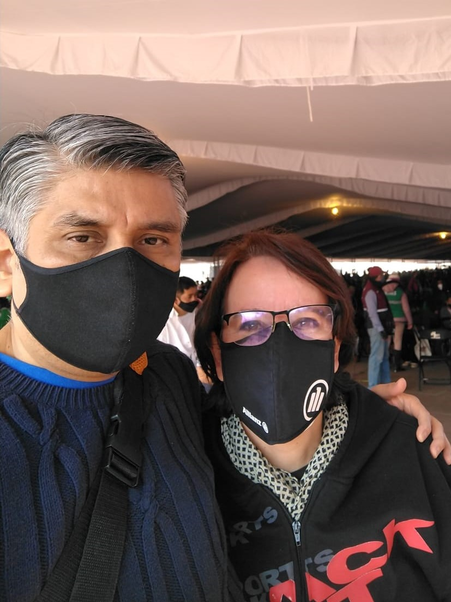
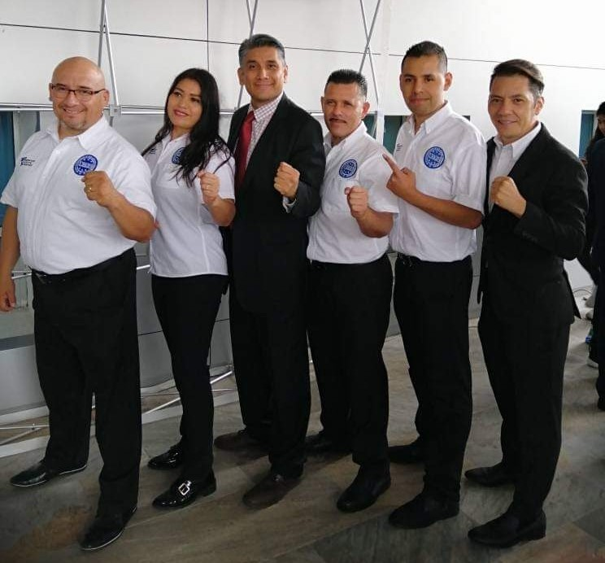

Beto is my brother-in-law and my *compadre* (I am the godmother of Bernardo, his first son), but the most important thing is that he is the man my beloved sister chose as her life partner.

I’ve liked him very much since the beginning, but during all these years of knowing him, I have also learned to admire him because in a country like Mexico it is not an easy thing to negotiate with your partner the reversal of the traditional roles: my sister is the one who goes out to work (for pay), while Beto stays home to take care of my nephew Berni and my niece Rebe (work without pay).

During all these years he has been forging his own path (you will discover it below) and that is always such a wonderful thing.

Here are the answers, that Beto sent me, to my 10 questions:

***1. How would you describe yourself?***

I am a dreamer; I like to dream. I dream while I sleep, and I dream while I am awake. All the time I am dreaming: imagining things, making plans, making stories, anticipating, building the future.
I really enjoy helping others achieve their dreams. I don't go through life looking for someone to help, but when I come across someone who needs a little push, a pat on the back, a smile or just to be heard, I do it.
I am a dreamer who likes to help and listen to others.

***2. What do you want from life?***

To keep dreaming.
  
***3. Why do you do the things you do?***

I enjoy what I do.
I know that much of my activities positively affect the efforts and dreams of someone else and that motivates me.
  
***4. How do you understand the process of "what if I say yes?"***

For me it is doing what you want, daring to leave your comfort zone and overcome fears or obstacles; pausing or stopping on your way and deciding to go left or right instead of going straight ahead; doing unexpected things; taking chances; reinventing yourself.
  
***5. What would you say was your first "what if I say yes" moment?***

I don't know what the first was, but one that comes to my mind is when we (my wife and I) decided that we would change our roles: she would return to her professional job, and I would leave the office and spend most of my time with our children.

***6. Describe your most recent "what if I say yes?" moment.***

My most recent moment is a series of moments: several years ago (I was 38 and now I am 52) my two children practiced Karate and Bernardo, my eldest son, said that he no longer wanted to continue.

I approached his Sensei and told him that I would practice too. I made a commitment and had not yet requested permission from the office to leave early two days a week; fortunately, they agreed, and my children and I continued practicing.
Today, my son has already won the National Championship in his category in Kickboxing and participated in a world championship; I am a Black Belt.
Years later, that moment of saying yes led me to say yes to lead the Mexico City Kickboxing Association and later to be part of the National Kickboxing Federation, where I continue to dream of ways to get more people to practice the sport, help develop more champions and help anyone achieve their goal as an athlete without them having to worry about not finding resources.

***7. What things have you created in your life after saying "what if I say yes?" Make a list.***

Above all, personal satisfaction, and making someone else smile.

***8. How have others reacted to your “what if I say yes?” process?***

The “What if I say yes?” process is an internal one, belonging to each one of us… I am sure we all call it differently.
But every time I dare and achieve something, positive energy flows and this energy provokes positive reactions in people: empathy, smiles, gratitude.
All good things!
  
***9. What will be your next “what if I say yes” moment?***

I don't know, but whatever it is I'll tell it “yes”. Why not?
  
***10. What have you learned from the "what if I say yes" process?***

Dare yourself! It's worth it.

Beto can be found at:

[WAKO CDMX](https://www.facebook.com/WAKOCDMX)

[Facebook](https://www.facebook.com/beto.cordova.397)

