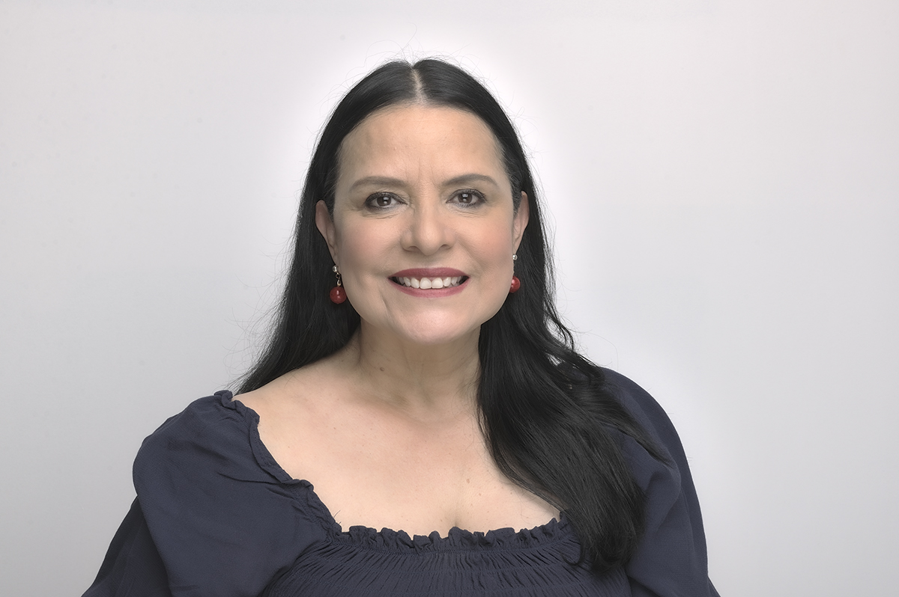
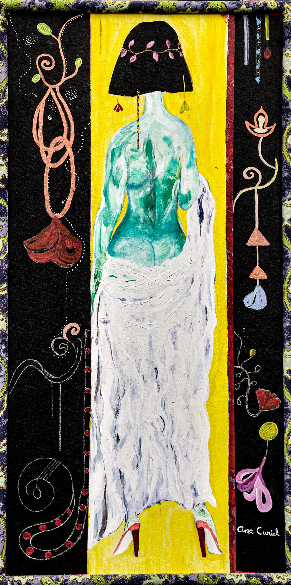
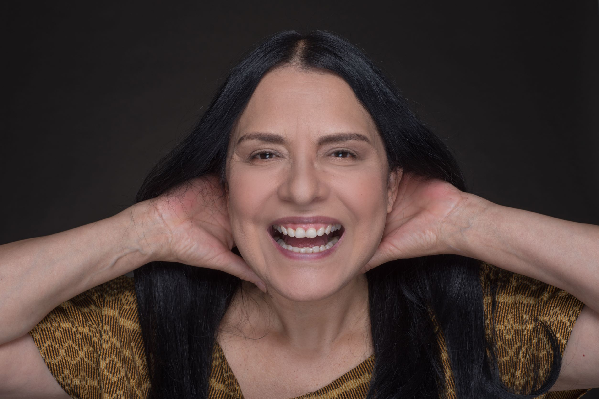
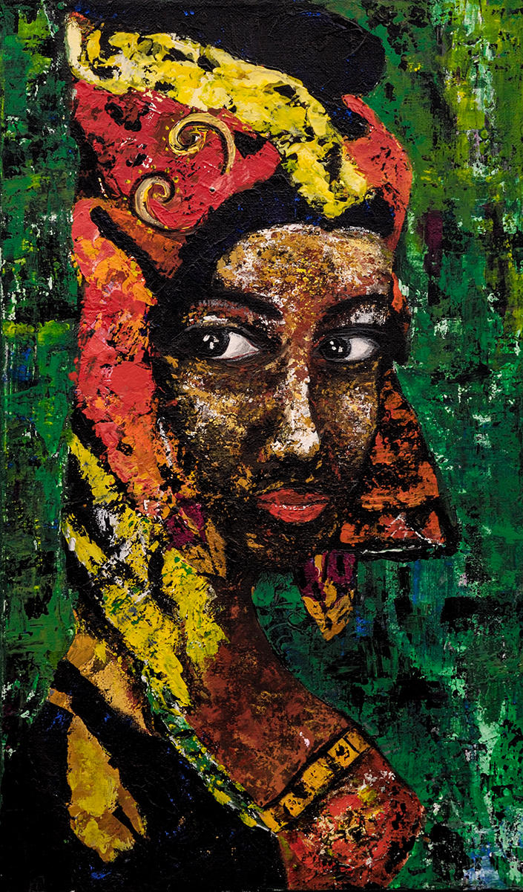

Ana Laura (I call her Aniux) was married to my eldest brother, but I still call her my sister-in-law :)

I wanted her to be the “What If I Say Yes Person of This Month” because she was born in March. This is like my Happy Birthday gift for her.

Here are 10 questions I asked her, so you can get to know her better:

***1. How would you describe yourself?***

When I was a child, I remember there was a wooden ladder always leaning against the wall on the patio of my house. Nobody used it because they said it was already old. Besides, we could fall and hurt ourselves. However, I used to climb it and was not afraid. They told me that the ladder would not take me anywhere, but I felt as if I were touching the sky with my hands. I dreamed of other worlds. Now I understand that this has been a life journey. And that my dreams have helped me to make those worlds come true; they have helped me to become who I am.

“Ana through the window!” That's what they called me for some time since I have a habit of observing people. I'm curious. I want to imagine their world. That, sometimes, allows me to recreate said worlds when I play a character.

A few years ago, I discovered dance halls (*salones de baile*), some of which have existed for more than 80 years. When I go, I have a complete ritual that has to do with my whole attire. As I'm putting on my makeup, the appropriate shoes are waiting for me. They are covered with fabric and have heels for professional dancers. I wear bright and large accessories.

Arriving at the *salón* I have the feeling of entering another era like I'm in a movie. I am one of the best Danzón dancers in Mexico. The music accompanies my movements, and the swaying causes the movement of my dress with its ruffles, tassels, and textures.

Something I have noticed is that when I arrive at a gathering with painters, writers, or friends from other environments, people are happy to see me. They tell me I harmonize the energy, that my joy is contagious, but above all things, they say they have learned a lot from me, that I am an example of a life well-lived. And when I ask why, they say it's because they see a strong, resilient, unstoppable, and successful woman. They make me feel very good when they tell me that.

It has not been easy, you know?

I have made mistakes; some marked my life and I regret it. Yes, I have stumbled many times and have had to reinvent myself because as I've said, I believe in the power of dreams, goals, and forgiveness.

A short time ago, while I was removing my makeup in front of the mirror, I discovered myself. I was surprised and liked the woman I saw and said to myself: "Yes, this is who I am, I accept myself."

From that day on, I am aware of my personality, and I can tell you that I get along with myself, I love myself, I like myself and have learned to accept the person I am.

I love myself. I love my life. And what I love most in life is my son Luis whom I admire and respect. When I am with him, I am very happy.

***2. What do you want out of life?***

Give as much as I have received. Enjoy it as the most joyful melody, the most surprising book, and the most loving company. Continue to delight in the conversations and teachings of my son Luis. Love and be loved.

***3. Why do you do the things you do?***

I remember one day while watching one of my favorite tv shows, I stopped to observe a specific host who articulated words very well and denoted cultural knowledge. I asked myself: “What if I were that lady?”

At that time, I lived in an area very far from the best theater schools, but, regardless, I enrolled in one. Some time passed and, in one class, the teacher asked me if I wanted to go to a casting because they were looking for a TV host.

Guess for what show? Yes! For my favorite cultural tv show.

I asked myself again: “And what happens if I say yes?”

I went to Televisa, passed very difficult tests, and was accepted. In addition, they made me the head of another classical music show.

Thus, I began to understand that the ladder does not move if I do not advance. That fear is poverty, ignorance, insecurity, and lack of faith.

Today I have continued as host of several cultural tv shows and I am currently a guest host at an important show at the Autonomous National University of Mexico (UNAM).

Here's a list of things I've done since I asked myself that question:

And what if I say yes and accept the adventure of driving to Alaska?

What if I later agree to go on another trip to Antarctica, also by land?

What if I go to Paris to be in an acting workshop to improve my acting skills, with the Théâtre du Soleil?

What if I create my own Coaching company?

What if I offer my services as a speaker (based on the experience I have gained with TV Azteca) giving conferences all over Mexico supporting women?

What happens if I go to the *Universidad de Londres* and tell them that I want to teach there?

And what happens if I audition to record with Discovery Chanel as an announcer?

I remember one day my mom told me: “When something scares you, repeat these words: I AM, I KNOW, I CAN.” This is also how I titled one of my lectures.

What happens then is an exercise in confidence.

I realize how much I can achieve. I achieve something. And then simply go one step further and touch the sky with my hands again. I do it because I am alive and because I believe that we are here with a mission and my mission is to live a life as wonderful as it is.

***4. How do you understand the “What If I Say Yes” process***?

Look, if it's already crossed my mind to do something because I want to or because it's going to make me happy or maybe because I think I deserve it or for all those reasons together, then the only thing left to do is do it.

I understand it as a decision to be made. It's an opportunity to discover myself receiving the yes!

In addition, taking the step is for brave people. Congratulate yourself!

Do you remember I mentioned before that when I was a child, they told me that if I went up that ladder, I would hurt myself and would be in pain? Indeed, falling hurts, but you grow. In the end, growing hurts too.

***5. What would you say was your earliest “What If I Say Yes” moment?***

When I decided to leave my parents' house to find what I was looking for. I wanted to be an actress. I was already studying to become one, but the distance I had to travel was too much.

It was very difficult to leave, but that's where my story began.

The story of my profession as an actress with 35 years of artistic career.

***6. Describe your most recent “What If I Say Yes” moment.***

As an actress, I constantly go through “what if I say yes?” moments.

The most recent was a few days ago when I was negotiating to be in a movie.

On the one hand, I was not convinced because of the budget they had. But on the other, they were promising to improve it as the circumstances unfolded. The issue was that the promise was not going to be in writing. It was a verbal promise.

I was having doubts, but I finally said yes! Right now, I'm still working.

They kept their promise!

***7. What things have you created in your life after having said “What If I Say Yes”? Make a list.***

Deciding to seek a different life than the one I had in my childhood.

Meeting wonderful people who left a mark in my life and great lessons full of love.

Having my son Luis.

Having a lot of confidence in me.

Knowing how to wait for another opportunity to come.

Not forcing things or people because there is a time for everything.

Having confronted my ego.

***8. How have others reacted to your “What If I Say Yes” process?***

In general, I have surrounded myself with wonderful people. They encourage me, ask how they can support me, make recommendations; other times, they empathetically tell me stories of what has worked for them.

I have been learning from the people in my life, most of the time it's been in loving ways, with affection. And I am very grateful.

***9. What will be your next “What If I Say Yes” moment?***

Pursue an additional university degree. Currently, I keep studying and perfecting my skills. I consider myself competent and with the skills and abilities to perform the positions and jobs that I perform; but, I want to have a degree in Acting or Dramatic Art.

***10. What have you learned from the “What If I Say Yes” process?***

That I must trust in magic, my mental power, love, and continue to be grateful.

That I should believe in myself. That after the mountain there can be paradise. That life has endless possibilities. And that I should enjoy the decision-making process.

You can find Ana Laura at:

[Website](https://www.analauraespinosa.net/)

[Instagram](https://www.instagram.com/ana9lauraespinosa/)

[Facebook](https://www.facebook.com/ana.l.espinosa.9/)

[YouTube](https://www.youtube.com/channel/UCLGTZH0kpx3Am0Xt-IjrQGw)
