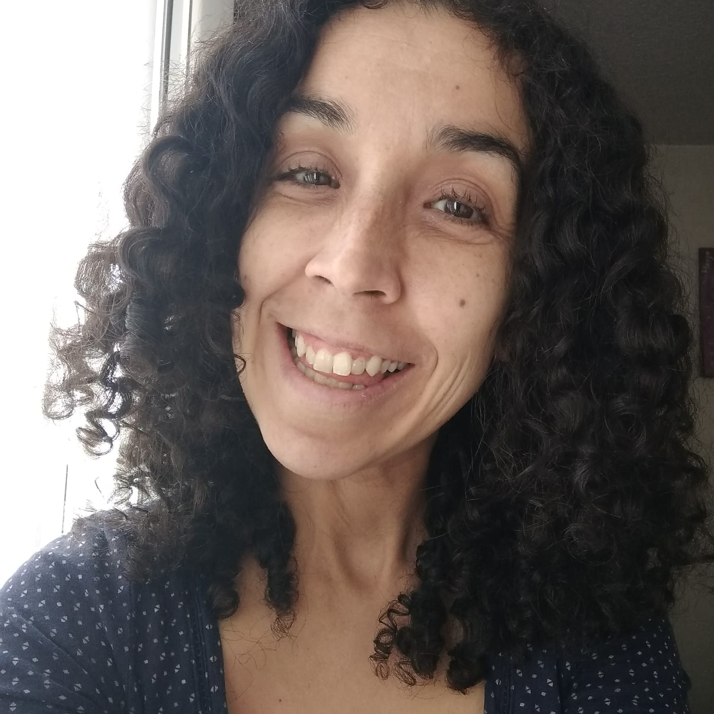
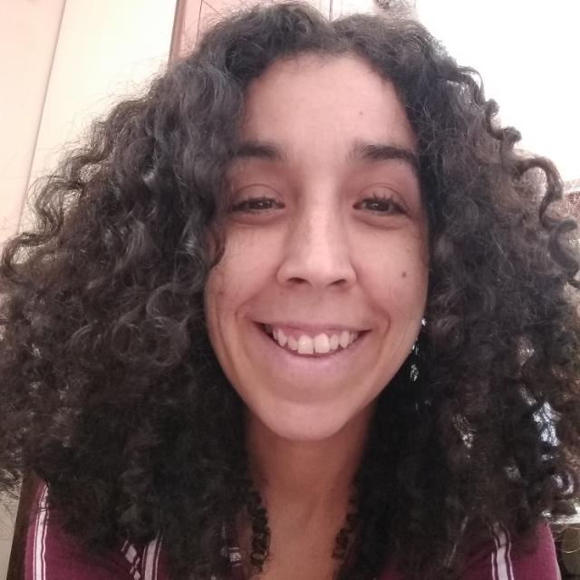

This month I chose a first cousin who has deep questions about life and human beings. She also has a creative vein that she uses to always explore those thousands of ideas that flutter through her mind. One of the memories I have of her when she was a baby and then a little child is that she didn't talk much…but when she finally started to talk, wow! She left us speechless at the clever things she said and the words she used. All that time she wasn´t talking, she sure was spending her time observing all of us and reflecting on what it meant to be a human being.

As you will see below, Mon is now a woman of many talents.

Here are my 10 questions that will help you to get to know her better:

***1. How would you describe yourself?***

What I like most about myself is that I am creative. I take an idea and link it to another, and I ask questions with the outcome, exaggerate the idea to see what happens or draw it. Anyway. I always try to think of new things. I also like balance. A long time ago I decided that I always must read both sides of a debate. A supervisor would always listen to me tell the story of some patient and say, “ok, but what if the story was the other way around?” I love that question because it opens up the mind to other paths. I think that doubting is always necessary.

I am a worrier. I am always thinking about where events are leading up to and trying to solve them without even being there. Sometimes I need to slow down and not take myself so seriously. That's why a sense of humor is important. Stopping to laugh is one of the most liberating and nourishing things I can do for myself.

I think I'm good with words: sometimes I don't remember where I read them, but I can give them away without any problem and have one for every occasion.

***2. What do you want from life?***

Unlimited coffee and chocolates. I also like order, although not of objects, but of ideas, of feelings. I would love it if at the end of time everything settles down, that all those great questions humanity poses find their box, like in a great sudoku game. And that in the end, some kid puts the 9 in its place and in the whole universe sounds “click”! All settled.
  
***3. Why do you do the things you do?***

I have no reason to suspect that everything will go wrong or that everything will go well. I don't have that kind of compass. But I do know that it makes a difference choosing to think that the day-to-day and the grain of sand each one of us adds are worth it. After worrying, I choose to believe that things will work out and that it is worth continuing to build humanity together. So, despite my concerns, I act.

I believe in people, and know that those who come after us, our children, deserve adults who help them to have hope. Cynicism and a meaningless life are easy. Having hope becomes a brave and compulsory act with the following generations.
  
***4. How do you understand the process of "what if I say yes?"***

I ask myself a lot of questions all the time. When I organize my questions into some reasonable story that I like, I try to make it come true. It's like writing the book of my life before I live it, but it's so good that I want to make it real.
  
***5. What would you say was your first "what if I say yes" moment?***

I was like 9 years old and one day I started to cry. A lot. Those who say that children are never sad simply do not remember. I remember not liking where my life was going and making a list of things I wanted to change. And I changed them!

***6. Describe your most recent "what if I say yes?" moment.***

A friend who is a therapist invited me to his [Facebook Live](https://www.youtube.com/watch?app=desktop&v=LAYGFgtbIkw&feature=youtu.be). It was about the movie Encanto seen from the perspective of family therapy. I had never done something like that but was glad he invited me. He is a very cool guy. I think that joy is a good compass for action, so without thinking much but savoring my smile I said yes.

*7. What things have you created in your life after saying "what if I say yes?" Make a list.*

- A university newspaper published something I wrote.
- I volunteered at a therapy hotline.
- I led a weekend spiritual retreat.
- I found a social service that really fascinated me because it was with the elderly.
- I work daily on the road to a happy old age with my love, my husband.
- I started a comic with the adventures of my family, which I love because it forces me to think about things in a softer and more sympathetic way.
- I challenged myself to dance in public at 10 different events.
- I accepted a job that terrified me and of which I feel super proud: I conducted therapy sessions with kids that were in trouble with the law.
- I started my family by adopting 2 beautiful children.
- I was featured in 2 TV interviews talking about adoption in Mexico.

***8. How have others reacted to your “what if I say yes?” process?***

With proximity. I think the more I search for myself, the more I find my shared humanity.
  
***9. What will be your next “what if I say yes” moment?***

I do not know yet.
  
***10. What have you learned from the "what if I say yes" process?***

It helps me a lot to live life as part of a team. Having people who support me, who listen to me, love me, and accompany me to laugh. I hope to be their teammate as well. The journey’s not worth it if it's not as part of a team with people you love. And when I venture out, I win stories. In the end, I think that's what we are: a bunch of stories we tell the ones who come after us, that run for generations, like the murmur of a stream that joins another, and then another and forms a great waterfall in the end.

