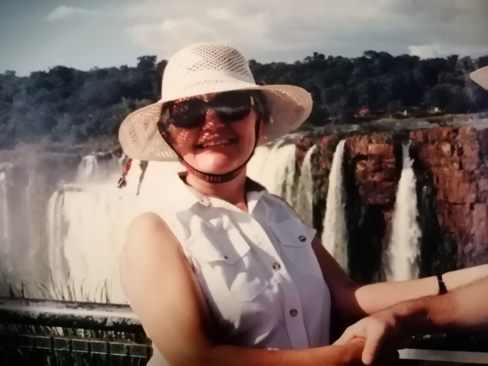
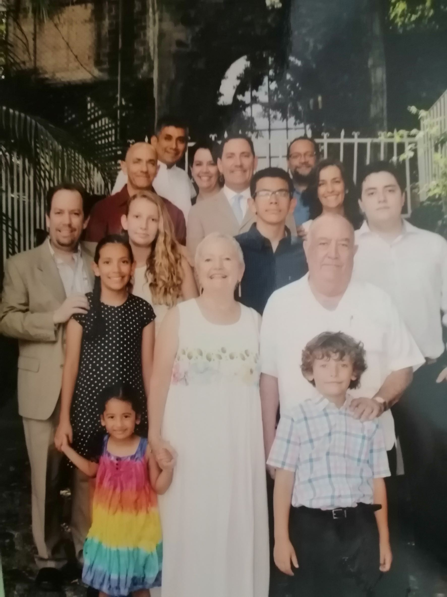

In a text that I gave my mom many years ago I described her as "the force that unites everything."

She had 3 sons and 2 daughters with my father before she turned 30 and during all these years he has raised, loved, advised, guided us and her 3 grandsons and 3 granddaughters.

She is an unstoppable woman with a great heart.

And although outwardly she would seem to have lived a very traditional life (a woman dedicated to her home and her family), her life has not been traditional at all. She has done what she wanted when she wanted it. Nothing has been imposed on her.

Here are 10 questions I asked her so you can get to know her better:

***1. How would you describe yourself?***

As a sensitive person, with a lot of empathy, who loves her family above all, interested in culture, a very good listener and willing to experience new challenges.

***2. What do you want from life?***

That my family and I have health and that we can do what interests us.
  
***3. Why do you do the things you do?***

Either because I feel it is my responsibility or because I like to do them.
  
***4. How do you understand the process of "what if I say yes?"***

I understand it as accepting a challenge.
  
***5. What would you say was your first "what if I say yes" moment?***

The first thing that comes to mind is when I agreed to be the girlfriend of my now husband, 58 years ago.

***6. Describe your most recent "what if I say yes?" moment.***

If not the most recent, it is one that I consider very important: When I agreed to take the course to join the group of Volunteers of the Mexican Institute of Social Security (IMSS).

***7. What things have you created in your life after saying "what if I say yes?" Make a list.***

Great satisfaction as an IMSS Volunteer

Good relations with my family.

Good relations with my friends.

***8. How have others reacted to your “what if I say yes?” process?***

Supporting me.
  
***9. What will be your next “what if I say yes” moment?***

It just happened:

My grandson and his girlfriend each have a dog.

For them to visit us in Cuernavaca, they must bring their dogs because they have no one to leave them with.

If they want to stay overnight, I only have one bedroom available, but it has carpet, and I didn't want the dogs to get in there.

Finally, it seemed to me that the relationship with my grandson was more important than the carpet and I said that they could come with their dogs and stay in the bedroom with them.

Nothing bad happened and we all had a very good time.
  
***10. What have you learned from the "what if I say yes" process?***

That it is always a challenge and a learning possibility… whatever the result.

