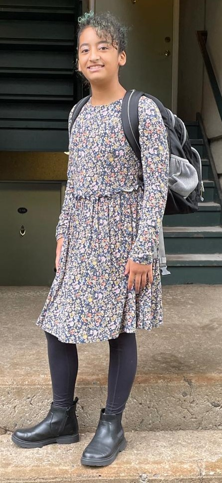
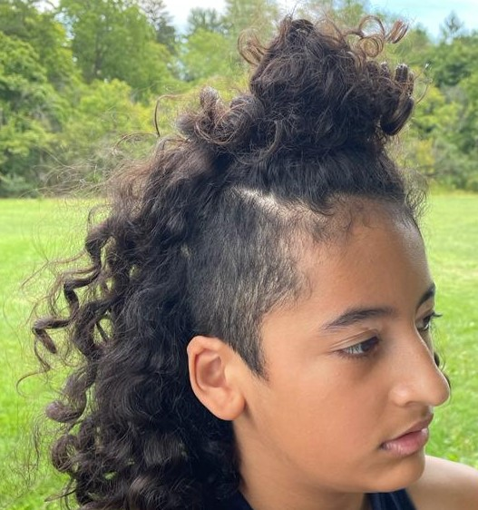
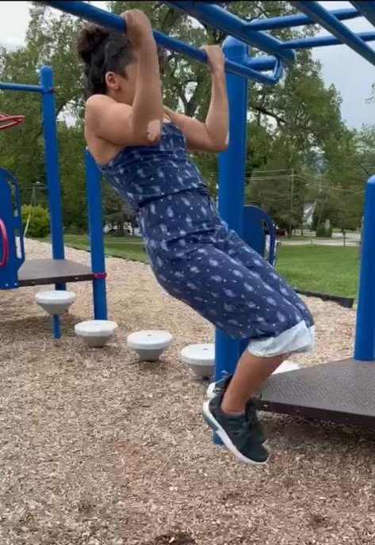
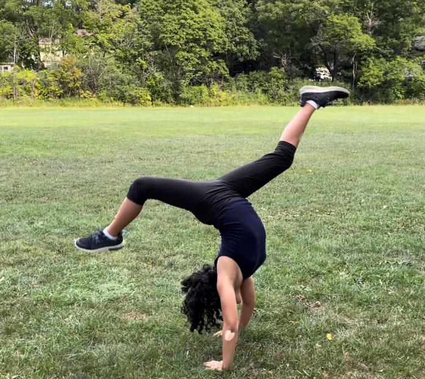
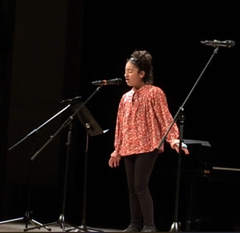

Maya is my only child. She’s the center of my life and my reason for living. She has been my teacher since before she was born. There are so many things she has taught me over the years just by being herself and by the way she’s carving her own path in this adventure called **LIFE**.

I admire her so much, and I love her like nobody else on this planet. I am very proud to be her mom :)

Here are 10 questions I asked her, so you can get to know her better:

***1. How would you describe yourself?***

I describe myself as brave. Brave to do anything I put my mind to. Adventurous. Adventurous enough to go into the woods and play. And Kind. Friends are really important to me; they help me get through things. They are kind to me, so I am kind to them.

***2. What do you want from life?***

I want to be able to do anything and everything I love and be with people I love without other people getting in the way too much.
  
***3. Why do you do the things you do?***

I do the things I do because I want to do them. I am a person who likes to get my point across, so I don’t let anyone stop me.
  
***4. How do you understand the process of "what if I say yes?"***

I understand it like this: There are some things in your life that you don’t really want to do, and you think that if you don’t do them and say no, nothing will happen. But when you think about it, you may not be able to have that opportunity again. So, you decide to say yes to it. I think that saying yes to something means you are trying something out, and it just might change something.
  
***5. What would you say was your first "what if I say yes" moment?***

Well, I don’t think this was the first time, but it’s the first one I can remember: When I was in elementary school at CHES, there was a Talent Show. It sounded fun, but really scary at the same time because it was on a stage in front of the entire school, and I’d have to perform something. But then I was thinking how fun it would be to do it for the first time, so I faced my fear and did it. If it weren't for that moment, I wouldn’t have even thought of doing it in middle school, but I did it and I’m going to do it again!

***6. Describe your most recent "what if I say yes?" moment.***

When we went on the trip to New York City, one of the places we went to was Coney Island. And there was a roller coaster named The Cyclone. At first, I was soooo excited to go on it because my dad had told me so much about it and about how he went on it as a little kid. But as we were walking to the entrance, I started to get really scared; however, I decided to go through the turnstile anyway. After that, I was horrified. I felt so lightheaded because I was not expecting that. We went on all the other rides, and I was scared to go on The Cyclone again, but I knew that going on it one last time before we left would help me get over that fear. So, at the end of the trip, we were about to leave, and I finally said yes. I went on the roller coaster, and it was the best thing ever! I can’t wait to go again!

***7. What things have you created in your life after saying "what if I say yes?" Make a list.***

I said yes to taking gymnastic classes and now I am on the team.

I practice violin, and so every year I say yes to entering the NYSSMA Spring Evaluation Festival, where they evaluate my level of mastery.

I joined a little league baseball team for one season, and all my teammates were boys.

I said yes to becoming more confident at school and being less shy with people.

I said yes to singing a song at the Variety Show last year (6th grade) and sang “How Far I’ll Go” from the movie Moana.

***8. How have others reacted to your “what if I say yes?” process?***

My dad and my mom are glad I said yes to these things, and my friends are glad that I’m their friend, so everyone is happy!
  
***9. What will be your next “what if I say yes” moment?***

I don’t know yet, but I think it’s going to be as cool as all the other times!
  
***10. What have you learned from the "what if I say yes" process?***

I have learned that saying yes is a really good thing because when I do say yes, I try new things and expand my horizons.

