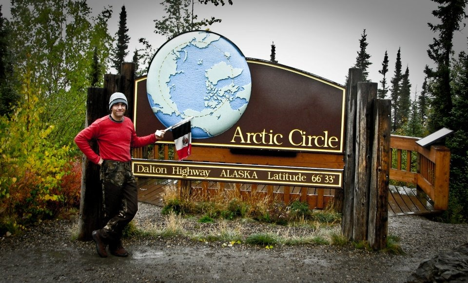
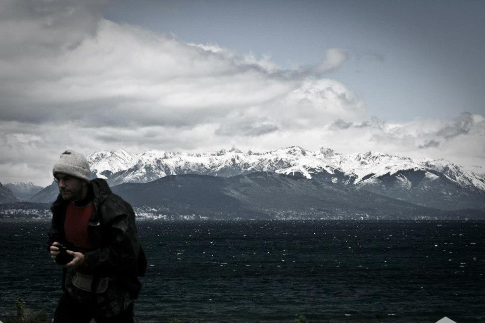
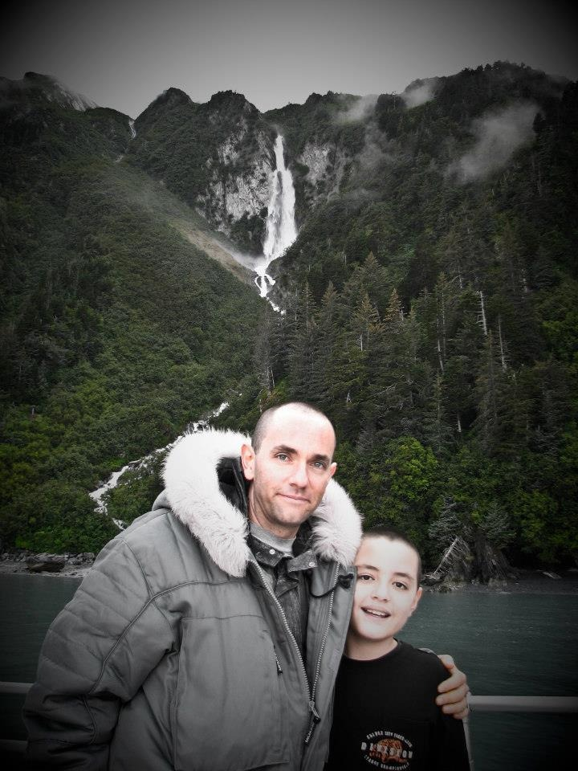
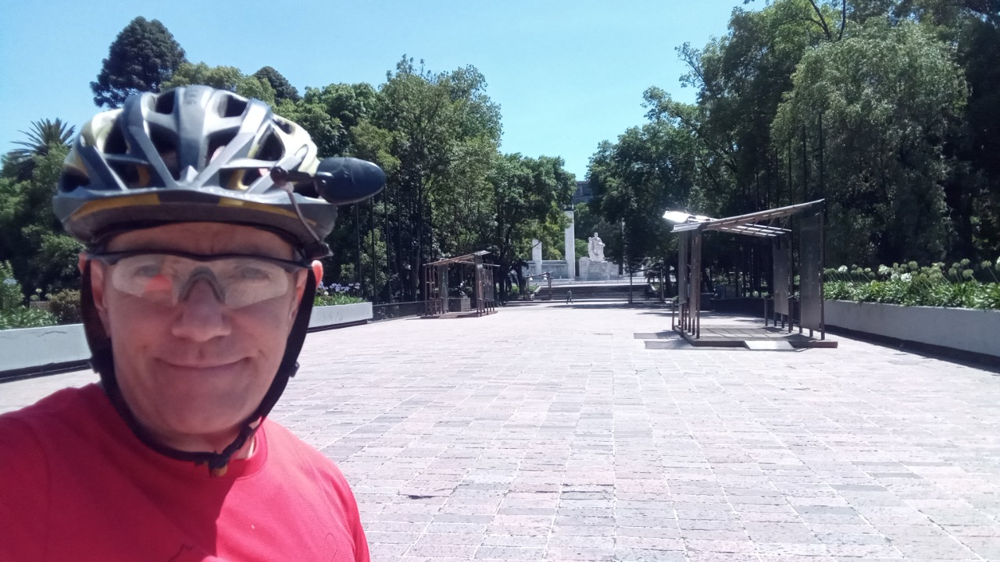

Luis is the perfect example of someone who is willing to face their fears and try new, bold, and exciting things.

As my oldest sibling, he was the one leading the way, and we were always amazed at mainly two things: his capacity for adventure and his discipline for studying a specific matter.

Here are 10 questions I asked him, so you can get to know him better:

***1. How would you describe yourself?***

I always liked to learn. Ever since I remember I was always interested in understanding how things worked or were done. That has led me to live different stages in my 55 years, through which I think I have gradually changed until I consider myself a totally different person between stages and throughout my life.

Currently, my focus has turned to inner peace, without dependence on the external, and for example, my enormous discipline (with which I was able to materialize almost all the projects on which I have embarked, and for which I suffered for five and a half decades), is gradually turning into joy and the opening of a mental and physical potential that I never imagined lay within me.

***2. What do you want from life?***

Inner peace.
  
***3. Why do you do the things you do?***

I'm just learning that everything we do is compulsive. Somehow humanity has lost the real meaning of life, which is life itself, and has confused it with the accessories of life (work, family, recreation, etc.)

The only correct way to initiate an action, whatever it may be, is from inner peace.

The action immediately becomes conscious, and instead of seeking joy through external stimuli, the joy of the action adds to the peace that was there before.

Inner peace cannot be the goal; on the contrary, it is absolutely indispensable to be able to think of real joy.
  
***4. How do you understand the process of "what if I say yes?"***

“No” is protection. We make houses to protect ourselves, but if we don't put doors, then the protection becomes your cell.

“Yes” are the open doors. We protect ourselves, but we always hope to go out into life and live it.
  
***5. What would you say was your first "what if I say yes" moment?***

Very difficult to know which was the first... but I remember that on the website that my brother Jorge made for our 2005 trip to Alaska in the SUV, some friends who did adventure racing suggested the trip to Patagonia.

I distinctly remember thinking, “That's never going to happen.”

In 2007 I must have thought: “what if I say yes?”

Cut to 2008: We went to Ushuaia in the SUV.

***6. Describe your most recent "what if I say yes?" moment.***

I have been totally focused on my work, my study, and my physical training, without looking to date any women.

Recently, due to the new concepts I have learned about life, I have decided to call a friend and go out with her.

***7. What things have you created in your life after saying "what if I say yes?" Make a list.***

It is not a thought that I normally operate on.

In general, I do what I say I am going to do.

I mean, I don't think my fears have held me back much in all the projects I've been involved in.

I am always ready to accept the next challenge.

Perhaps two important ones are the Music School I set up in Cancún in 2018 and the trip to South America and Antarctica in 2008 in my SUV.

***8. How have others reacted to your “what if I say yes?” process?***

Almost always with warnings, fear, concern, and skepticism. But now that the years have passed, I think they think of me rather as someone who does what he says.
  
***9. What will be your next “what if I say yes” moment?***

Probably the construction of a new studio in the house, which we want to be a school and a professional studio at the same time.

The economic challenge is brutal.
  
***10. What have you learned from the "what if I say yes" process?***

As I say, it's not really how I approach things, but in the ones I've done, what I've learned is that you don't have to have fixed ideas about the future.

The future is a logical construction of the rational mind.

Outside of the neurons that are physically doing it, it doesn't exist anywhere, and no one can predict it.

The future, in the mind, is the past projected forward, so it carries all our mental biases: fears, prejudices, insecurities, etc.

Just when we allow ourselves to be surprised by the exquisite complexity of life and the cosmos in the present, without any expectation of the future, we can say that we are living a full life.

**You can find Luis at:**

[Instagram](https://www.instagram.com/stormfitnessandphoto/)

[Facebook](https://www.facebook.com/StormFitnessandPhoto)

