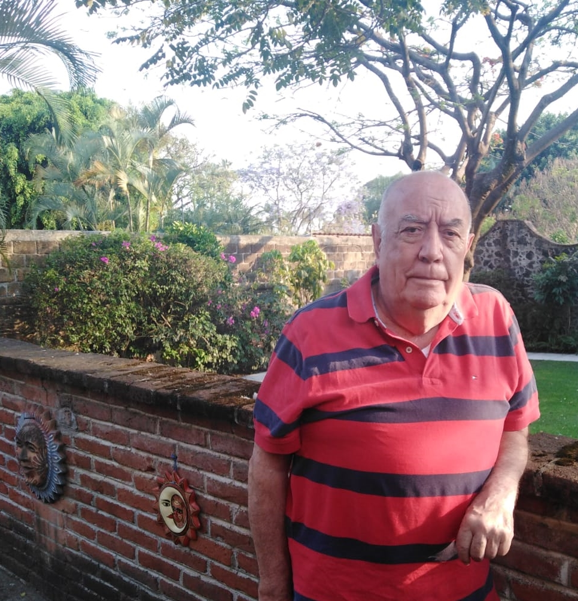
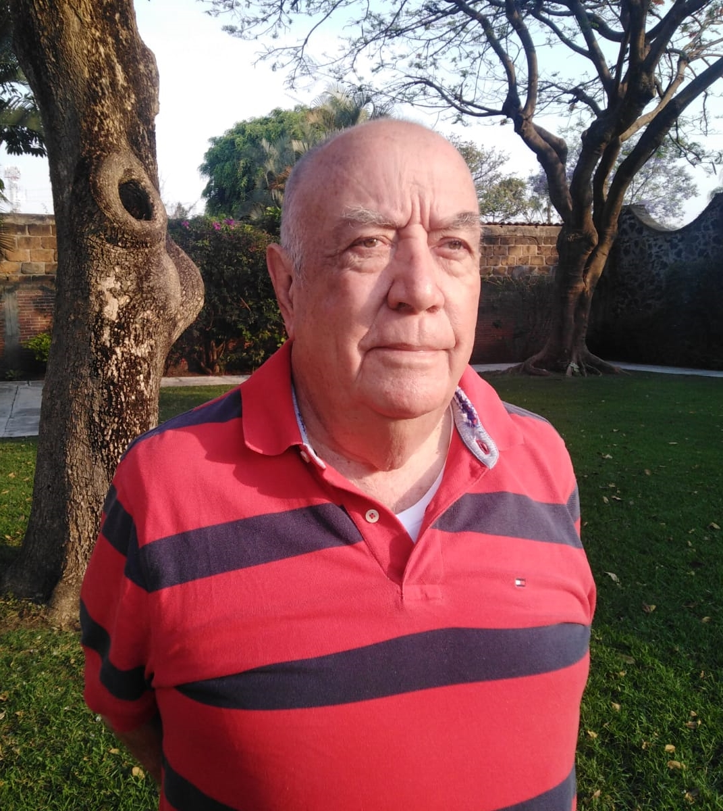

Ahora es el turno de mi papi, Luis Cárdenas Cuenca. Este mes lo nominé para ser la ***Persona ¿Y si digo que sí? del mes***, primero, porque este mes es su cumpleaños, y segundo, porque quiero celebrar lo afortunada que soy de tenerlo en mi vida.

Las personas que lo conocemos (familia, amistades, etc.) hemos aprendido mucho de él. Es para mí el ejemplo más claro de una vida bien vivida.

He aquí mis 10 preguntas para que lo conozcan mejor:

***1. ¿Cómo te describirías a ti mismo?***

Como una persona muy afortunada, que ha tenido oportunidades en todos los rubros de su vida.

Veamos: soy, responsable, leal, honesto.

En ocasiones de mecha corta, diría mi esposa.

Gusto de la lectura y de los juegos de cartas en la computadora.

Me gusta el ajedrez.

Disfruté mucho el golf.

Me gusta el dominó.

Intenté siempre ser un buen esposo y un buen padre.

El estudiar una carrera universitaria me permitió aprender a aprender.

Disfruté mucho viajar por el mundo trabajando y turisteando.

Me preocupaba tener una vejez independiente económicamente.

***2. ¿Qué quieres de la vida?***

A estas alturas del camino, ver a mis hijos/as, yernos, nuera y nietos/as contentos/as con su vida, sabiendo que no todo es miel sobre hojuelas, pero que así es la vida.

***3. ¿Por qué haces las cosas que haces?***

Ahora, hago las cosas porque quiero.

***4. ¿Cómo entiendes el proceso de "¿qué pasa si digo que sí?”***

Lo siento ahora como un reto (no al nivel de experimentador ni explorador ni innovador como mis hijos/as).

***5. ¿Cuál dirías que fue tu primer momento de "¿qué pasa si digo que sí?"***

Te cuento uno que considero muy importante por ser otro parteaguas en mi vida, aunque no el primero.

Recuerdo cuando un compañero de trabajo (Ulises Pego Moscoso) me llamó a su oficina para pedirme un consejo, pues estaba sin saber qué hacer ante la oferta que muy probablemente hiciera la empresa IBM de tomar un retiro voluntario muy jugoso a los empleados que tuvieran más de 20 años trabajando.

Nos pusimos a hacer escenarios posibles y terminamos con su decisión de tomarlo si se lo ofrecían.

Dos semanas después me manda llamar y me dice “te tengo buenas noticias”. Yo pensé en su decisión, pero no era eso. Era que la compañía iba a cambiar el rango de años trabajados a más de 15 (y no de 20 como lo habíamos analizado), con esto yo también entraba en el plan.

Ese día manejando desde la Ciudad de México a Cuernavaca, que era donde vivíamos, no podía con la lluvia de ideas que revoloteaban en mi cabeza. Al llegar a casa, después de cenar y acostar hijos/as, mi esposa y yo nos sentamos a platicar y creo que ese fue el inicio del proceso de: ***¿Qué pasaría si decimos que sí?***

Implicaba dejar la seguridad de empleo, el seguro de gastos médicos, etc. y lanzarme a ser Consultor Independiente. Así que tomamos la decisión de la seguridad de la inseguridad (así le llamaba un amigo muy querido, Ignacio Ocampo) y aceptar el plan si me lo ofrecían. Lo cual pasó. Y aceptamos.

***6. Describe tu momento más reciente de "¿qué pasa si digo que sí?".***

Esta situación donde mi hija Lucía me entrevista.

Normalmente hubiera dicho “no” porque no me siento cómodo hablando de mí mismo.

***7. ¿Qué cosas has creado en tu vida después de haber dicho "¿y si digo que sí?” Haz una lista.***

En 1953, **fundamos el periódico** de las calles de Violeta y Guerrero, donde yo tenía la labor editorial y la caricatura. Duró pocas ediciones, pero nos divertía mucho el estar leyendo nuestro periódico en las tardes.

En 1957, creamos “**Heinen y Cárdenas, Investigadores Privados**”. No funcionó por falta de clientes, ja ja ja.

En 1967, Sergio Martínez, Raúl Velasco, Jorge (mi hermano) y yo, nos unimos para crear una empresa de construcción con oficinas en Balderas, en la Ciudad de México. La llamamos **MARVECA, S.A.**

En 1983, creamos una empresa de consultoría llamada **Sinergia, S.A.** en combinación con mi primer jefe que tuve en el Data Center de IBM, que fue Juan Tercero Barragán.

En 1988, tuvimos **una pequeña asociación** Luis Ayala, Douglas Payo y yo para dar cursos de ventas y planeación de cuentas a IBM de México.

En 1990, participé en la formación de una empresa americana llamada **e-Strategia Consulting Group**, con la que trabajé en Europa y en casi la totalidad de países de América.

Finalmente, por ahí de 2004, la última empresa que creé fue con Silvano Barba Behrens y la llamamos **Planeación en Sinergia, S.A.**

Por otro lado, en el año 1983, en el fraccionamiento donde vivíamos, tuvimos una crisis de falta de agua. El fraccionador se hizo a un lado y no quería arreglar el pozo que nos surtía al fraccionamiento. Empecé a organizar a los colonos y los llamé a una asamblea en un terreno baldío, donde les pedí que se reunieran por calle. Acto seguido, les pedí que se presentaran y que dijeran qué tanto compromiso querían tener con la colonia.

Les pedí que nombraran un representante entre ellos. Así lo hicieron y después junté a los representantes en la casa de una amiga (Anita Neve) para que entre ellos eligieran a un presidente, un secretario, un tesorero y los demás serían vocales.

Después de un rato salieron y me dijeron que por favor pasara y adentro me pidieron que yo fuera el presidente pues yo había logrado su organización.

**Después de crear la Asociación de Colonos** con el nombre de Provincias de Canadá, (pues no pudimos registrar el nombre de Bello Horizonte 1ª Sección, pues la 2ª Sección ya lo había tomado y nuestras calles todas tenían el nombre de una Provincia de Canadá), compré el terreno donde estaba el pozo y empezamos a desazolvar y luego terminamos perforando otro pozo.

Tratamos de entregar el pozo al Sistema de Agua Potable de la ciudad, pero no lo quisieron aceptar porque era reconocernos no como fraccionamiento sino como colonia y no querían más responsabilidades. Así que tuvimos que hacernos cargo nosotros y hasta la fecha **no hemos vuelto a padecer falta de agua**.

***8. ¿Cómo han reaccionado los demás a tu proceso de "¿y qué pasa si digo que sí?”***

Siempre que hay un cambio existe al principio un poco de resistencia y miedo, pero después cambia todo a aceptación y reconocimiento de que fue bueno el cambio.

***9. ¿Cuál será tu próximo momento de “¿y qué pasa si digo que sí?”***

No tengo pensado ninguno, pues como sabes, predecir es algo difícil sobre todo si se trata del futuro, je je je.

Pero si me toca alguno, ya empiezo a tener más tendencia a preguntarme: ¿Y qué pasa si digo que si?

***10. ¿Qué has aprendido del proceso "¿y qué pasa si digo que sí"?***

- Que siempre ganas con decir que sí, aunque esto puede ser doloroso; pero aprendes mucho de ese proceso.
- Que el que siempre se haya hecho algo de alguna forma no quiere decir que no haya una mejor manera que no se haya intentado todavía. Creo que es la base de la investigación.
- “Atreverse a fracasar” era una de las pláticas que daba a vendedores, pues es la manifestación de tu actitud positiva lo que te hace un triunfador en la vida. Los perdedores no se atreven porque eso es doloroso para su ego, o lo consideran una maldición (el fracasar) o una manifestación de su mala suerte, etc. El ganador o la ganadora siempre lo toma como una experiencia de aprendizaje, con buen humor, como un porcentaje de bateo, donde no siempre das home runs, etc.
- Y el interruptor de la actitud sólo lo puede mover uno mismo. Una forma de moverlo es preguntarnos: ***¿Y qué pasa si digo que sí?***

