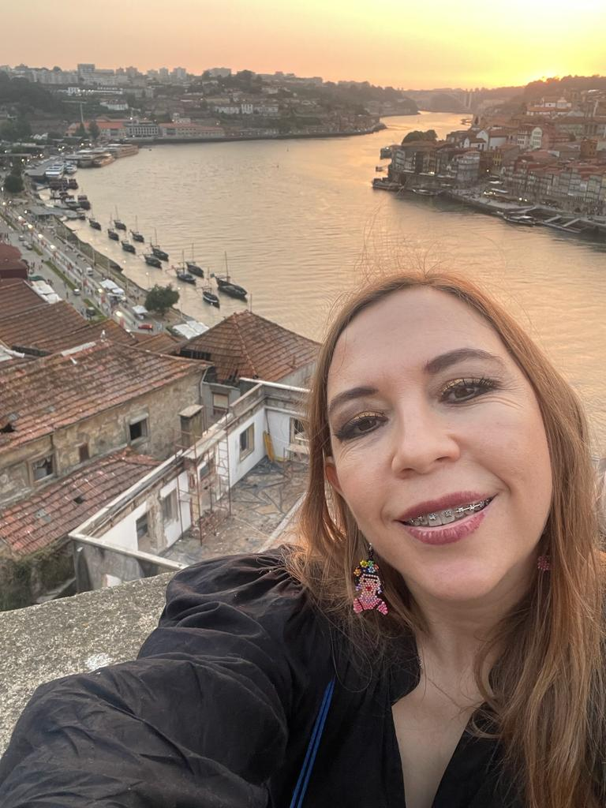
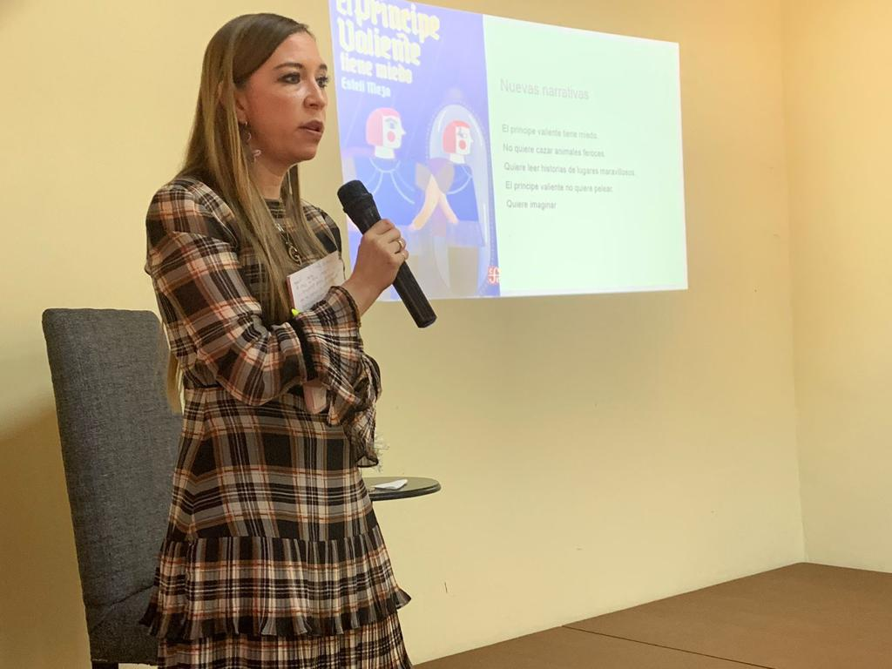
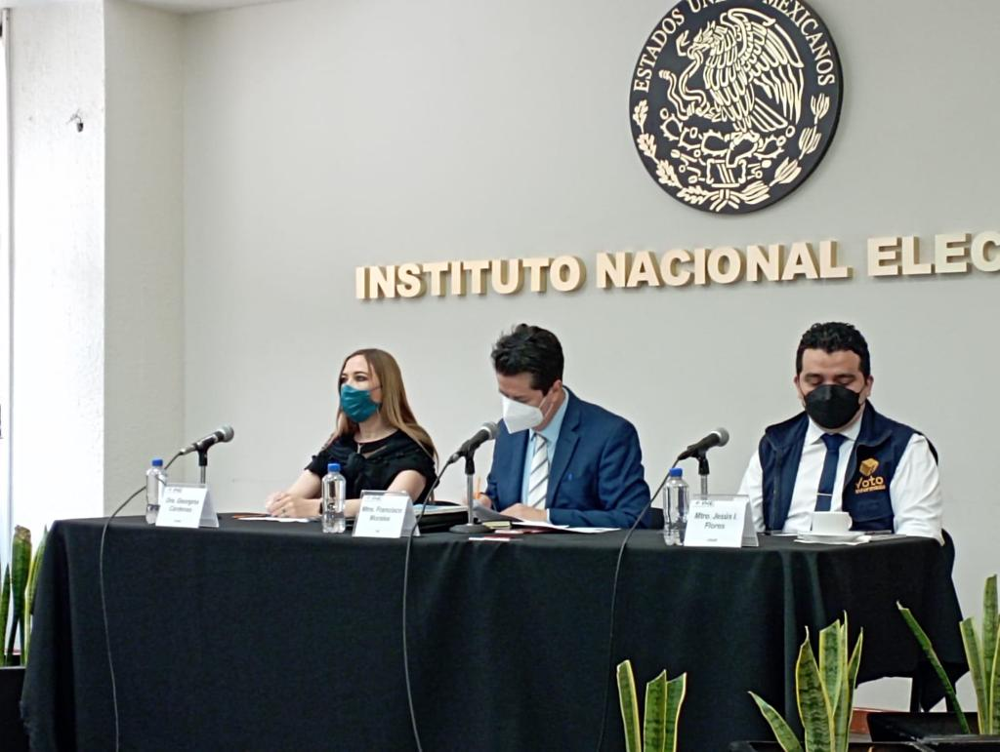
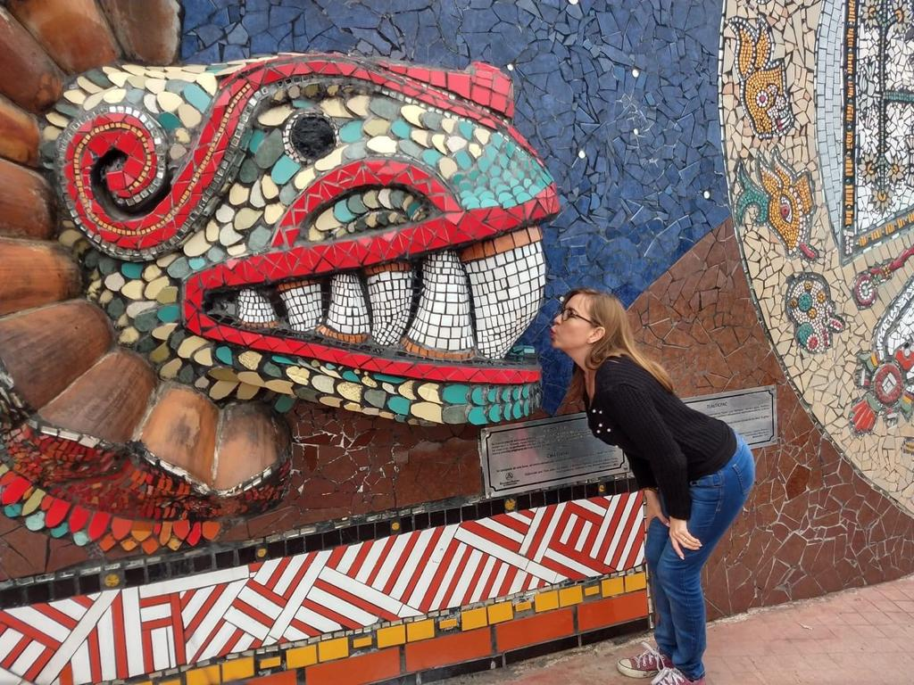

Gina (yo la llamo Georgina) es una de mis primas hermanas; la segunda hija del hermano de mi papá.

Desde chiquita se le veía que traía una chispa muy especial, como que se quería comer el mundo. Y ahora, ya más grande, casada y con hijas, se está comiendo el mundo un día a la vez.

Es impresionante ver cómo ha ido resolviendo todos los obstáculos que la vida le ha ido poniendo enfrente. Admiro la persona en la que se ha convertido y todo lo que ha logrado gracias a su trabajo y dedicación.

Aquí hay 10 preguntas que le hice para que la conozcan mejor:

***1. ¿Cómo te describirías a ti misma?***

Soy una persona divertida, comprometida que se fija objetivos.

Tengo de alguna forma cierta disciplina.

***2. ¿Qué quieres de la vida?***

En general: felicidad y calidad de vida.

Pero también me fijo objetivos a corto y a mediano plazo sobre lo que quiero, así que siempre hago algo para irlos logrando.

***3. ¿Por qué haces las cosas que haces?***

Por lo general, hago las cosas por pasión y eso me incentiva a seguirlas haciendo.
  
***4. ¿Cómo entiendes el proceso de "¿y si digo que sí?”***

Como darse a una misma la oportunidad de salir de lo cotidiano y/o de vivir la vida como socialmente te dijeron que tenía que ser.
  
***5. ¿Cuál dirías que fue tu primer momento de "¿y si digo que sí?"***

Ya había nacido mi hija Tania (yo tenía 19 años), y entonces había una expectativa social de que yo me pusiera a trabajar para hacerme cargo de los gastos de mi hija; sin embargo, había salido la convocatoria de la UAM y yo quería seguir estudiando.

Así que usé un dinero, que me regaló mi madrina Rocío por motivo de mi cumpleaños, para pagar el examen de admisión; esto es: ¿y si digo sí a mi sueño y renuncio a la expectativa social?

Y pues seguí el sueño.

Aún recuerdo que hubo cierta censura por mi decisión, pero mis papás me apoyaron y me dejaron seguir adelante cuando me aceptaron en la universidad.

***6. Describe tu momento más reciente de "¿y si digo que sí?".***

Bueno, hace poco, una amiga me dijo que iba a viajar a Portugal y pues yo le dije medio en broma: “oye, pues invita” y me invitó.

Entonces pensé, pues le voy a comentar a Niger (mi esposo), nada pierdo. Le comenté y me dijo: "Deberías ir" y pues estoy escribiendo esto desde Portugal.

***7. ¿Qué cosas has creado en tu vida después de haber dicho "¿y si digo que sí?” Haz una lista.***

Pues tiene que ver más con logros académicos y profesionales:

1) Tener una licenciatura en Sociología por la UAM (Universidad Autónoma Metropolitana)

2) Tener una maestría en Estudios de Género por el COLMEX (Colegio de México)

3) Tener un doctorado en Antropología Social por la ENAH (Escuela Nacional de Antropología e Historia)

4) Haber hecho un posdoctorado en el CIEG (Centro de Investigaciones y Estudios de Género) de la UNAM

5) Pertenecer al Sistema Nacional de Investigadores

6) No sé si he creado, porque suena muy definitivo, pero me procuro una vida con cierta estabilidad y consistente con mi posicionamiento político y social

***8. ¿Cómo han reaccionado los demás a tu proceso de "¿y si digo que sí?”***

Pues en algunos casos han juzgado mis decisiones; y en otros, veo que hay cierta admiración.
  
***9. ¿Cuál será tu próximo momento de “¿y si digo que sí?”***

Hace poco tuve un momento “¿y si digo sí?” y eso tuvo una consecuencia feliz que hará que tenga que hacer un cambio en mi vida.
  
***10. ¿Qué has aprendido del proceso "¿y si digo que sí"?***

Que vale la pena darse oportunidades en este viaje por la vida, porque no sabemos si va a ser corto o largo; de tal forma que vale la pena imprimir amor y pasión.

Pueden encontrar a Gina en:

[Facebook](https://www.facebook.com/FeministaCitadinaDeIzquierda/)

