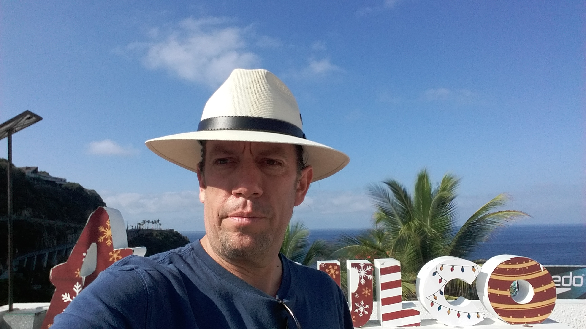

Jorge es mi hermano gemelo. Somos los más chicos de una familia de tres hermanos y 2 hermanas. Ha sido y es tan importante en mi vida que hasta le dediqué un episodio completo de mi pódcast “De regalos y palabras”.

Lo quiero con todo mi corazón y lo admiro profundamente.

Siempre ha sido un ejemplo de pureza de corazón y me ha enseñado a usar el arte para expresar tanto el dolor como la alegría.

Como el creador de [Pintores Mexicanos](https://www.pintoresmexicanos.com/) es uno de mis motores para seguir adelante creando y compartiendo las creaciones de las y los demás.

Aquí hay 10 preguntas que le hice para que lo conozcan mejor:

***1. ¿Cómo te describirías a ti mismo?***

Soy noble, tranquilo, perseverante, curioso.

***2. ¿Qué quieres de la vida?***

Amor y paz.

***3. ¿Por qué haces las cosas que haces?***

Porque creo que es lo que debo hacer para mi bien y el bien común.

***4. ¿Cómo entiendes el proceso de "¿y si digo que sí?”***

Creo que es como abrir una puerta, siempre vas a tener sorpresas.

***5. ¿Cuál dirías que fue tu primer momento de "¿y si digo que sí?"***

Me imagino que de niño, cuando me preguntaron si quería tomar clases de judo y dije que sí.

***6. Describe tu momento más reciente de "¿y si digo que sí?".***

Decidirme a diseñar libros de arte. Dudé mucho en hacer el primero en impresión de offset porque representaba una gran responsabilidad, pero finalmente me decidí a hacerlo y fue todo un éxito. Y, a partir de ahí, empecé a diseñar e imprimir más libros para otros artistas.

***7. ¿Qué cosas has creado en tu vida después de haber dicho "¿y si digo que sí?” Haz una lista.***

Bueno, con relación a los deportes que realicé, siempre le dije que sí a todos: patinaje sobre ruedas, fútbol, ping pong, esquiar en agua, esquiar en nieve, patinaje sobre hielo, fútbol americano, básquetbol, squash, natación, yoga, tai chi, chi kung, gimnasia olímpica, hockey sobre ruedas y hockey sobre hielo, tenis y frontón.

También, mi vecina me invito a tomar clases de pintura, y dije que sí, y a partir de ahí surgieron miles de pinturas padrísimas que salieron de mí que nunca pensé realizar. Hasta gané 1er lugar en un concurso profesional de acuarela y pintar se convirtió en mi segunda profesión.

***8. ¿Cómo han reaccionado los demás a tu proceso de "¿y si digo que sí?”***

Apoyándome siempre.

***9. ¿Cuál será tu próximo momento de “¿y si digo que sí?”***

Quiero visitar de nuevo la ciudad de Nueva York.

***10. ¿Qué has aprendido del proceso "¿y si digo que sí"?***

Que la mente imagina muchas cosas negativas antes de tomar una decisión, pero en realidad la vida siempre me ha sorprendido con la mayoría de las cosas buenas y algunas malas.

Y que hay que tener el valor para dar el paso y cruzar la puerta y experimentar la vida.

Pueden encontrar a Jorge en:

[Facebook](https://www.facebook.com/jorge.cardenas.aceves)

[Pintores Mexicanos](https://www.pintoresmexicanos.com/jorgec/)

