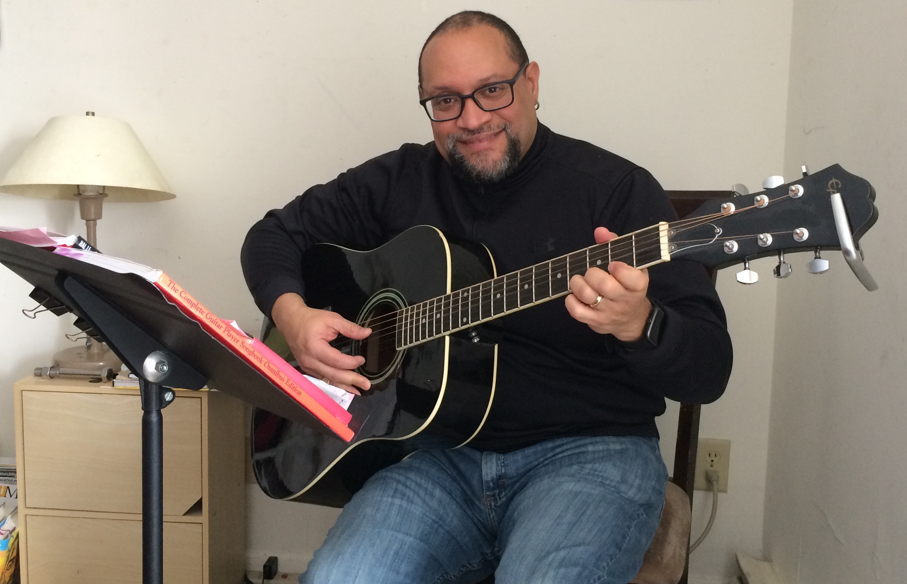
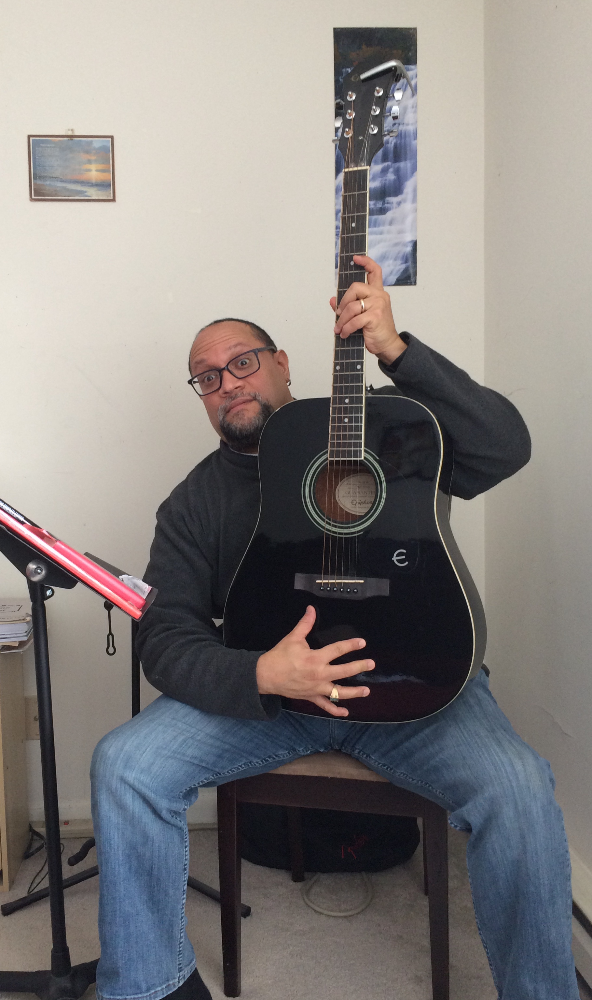

Carlos es mi querido esposo y el amor de mi vida.

Mucha gente lo conoce, pero pocos saben lo interesantes y variadas que han sido sus experiencias de vida.

Proviene de un entorno humilde y se ha forjado una vida hermosa gracias a la resiliencia y a una curiosidad infinita por aprender sobre política, religión, espiritualidad, deportes, comedia, humor, escritura, música, poesía, etc.

Aquí hay 10 preguntas que le hice para que lo conozcan mejor:

***1. ¿Cómo te describirías a ti mismo?***

Soy justo, curioso, ingenioso, sarcástico, amable y empático. Pero sobre todo, soy un buen oyente… cuando tengo tiempo. (Una vez más, ¡lo siento! jaja)

***2. ¿Qué quieres de la vida?***

Quiero que la vida sea amable conmigo a medida que envejezco y me vuelvo, ojalá, más sabio.

***3. ¿Por qué haces las cosas que haces?***

Hago muchas cosas grandes y pequeñas. Así que diría que hago estas cosas por varias razones:

1) para poder aprender algo nuevo. Nunca me da miedo probar algo nuevo, dentro de lo razonable; pero debe ser legal y apto para la familia. Creo en aprender cosas nuevas (por ejemplo: tocar la guitarra, leer teoría político-económica, escribir desde una perspectiva histórica, cocinar con un wok, cantar o rapear, pintar con los dedos, escribir poesía o hasta cortar carne roja en una carnicería) dando mi mejor esfuerzo, si es posible;

2) para sorprenderme a mí mismo de que realmente puedo hacer lo que me propuse hacer sin importar cuánto tiempo me tome (por ejemplo, empezar y terminar un doctorado y obtener una plaza permanente en una universidad);

3) para provocar una sonrisa en la cara de alguien, por ejemplo, mi querida y amada Mami (fallecida en el 2015), ofrecer un gesto generoso o dar una mano amiga que ayude a transformar para bien una vida (humana o de otro tipo) aunque sea por un segundo;

4) para sentirme realizado emocional, espiritual e intelectualmente, es decir, si me hace feliz, lo voy a hacer.

***4. ¿Cómo entiendes el proceso de "¿qué pasa si digo que sí?”***

Entiendo el proceso de "¿qué pasa si digo que sí?" casi como una teoría abreviada para ir al grano y avanzar hacia tus objetivos. Significa que, una vez que dices que ¡sí!, te estás comprometiendo a perseguir y lograr tus metas. Decir que ¡sí! significa planificar tus pasos con el mayor detalle posible, alinearte con personas positivas que puedan ayudarte en el proceso, y significa buscar la capacitación necesaria que pueda brindarte las herramientas adecuadas para hacer realidad tus sueños o metas. Un ejemplo muy claro, está en [esta entrevista](https://www.mccc.edu/~gardnerj/mccc_news/alum_carlos_figueroa.html) que me hicieron en el 2014.

***5. ¿Cuál dirías que fue tu primer momento de "¿qué pasa si digo que sí?"***

Diría que mi primer momento de "¿y qué pasa si digo que sí" fue cuando finalmente dije que ¡sí! a viajar y quedarme en el extranjero durante 4 meses para estudiar historia, política y literatura británicas lejos de mi familia y amigos más cercanos, a principios de la década de 1990.

***6. Describe tu momento más reciente de "¿qué pasa si digo que sí?".***

Bueno, mi momento más reciente de "¿y qué pasa si digo que sí?" fue tomar una decisión largamente esperada de desarrollar mi comedia (¡lo he querido hacer, quizás, desde que tenía 8 o 9 años!). ¡Oh, la ironía! He estado pensando y soñando con hacer algo con la comedia, desde monólogos (stand-up), ensayos humorísticos, guiones para comedias de televisión y actuar, hasta escribir para programas nocturnos, solo por mencionar algunos. ¡Los mantendré al tanto!

***7. ¿Qué cosas has creado en tu vida después de haber dicho "¿y si digo que sí?” Haz una lista.***

¡Guau! ¿Cuánto espacio tienes en este sitio web? Seré breve. No necesariamente creé cosas concretas o materiales, pero fui el primero en mi familia en ir a la universidad en todos los niveles (grado asociado, licenciatura, maestría y doctorado); fui el primero en mi familia en aprender a conducir un auto con palanca de velocidades (compré mi auto por alrededor de $400 dólares y casi me mato saliendo del estacionamiento); comencé mi propio negocio -de corta duración- vendiendo sistemas de filtración de agua a los 18 años; conduje sedanes y limusinas para ahorrar dinero extra para la universidad mientras mis amigos estaban en la playa; y dije que ¡SÍ! al amor verdadero (después de que mi mami me dijera “déjate querer”), me casé y luego tuve mi primera y única hija. Compartiré más en mi autobiografía, bueno, una vez que le diga que ¡sí! a eso.

***8. ¿Cómo han reaccionado los demás a tu proceso de "¿y qué pasa si digo que sí?”***

La gente ha reaccionado o con sorpresa, orgullo y alegría, o con miedo en los ojos, celos y desprecio. Pero a final de cuentas, por lo general evito las vibraciones negativas y me enfoco en la naturaleza alentadora de las personas, sus intenciones positivas y sus ideas o sugerencias útiles para hacer realidad mis objetivos.

***9. ¿Cuál será tu próximo momento de “¿y qué pasa si digo que sí?”***

Tengo varias cosas en mente. Ya hablé de una en la pregunta anterior. Sin embargo, compartiré más de ellas con el tiempo. Manténganse al tanto.

***10. ¿Qué has aprendido del proceso "¿y qué pasa si digo que sí"?***

He aprendido a planificar tanto como sea humanamente posible mi proceso una vez que digo ¡sí! También debe haber espacio para la espontaneidad dentro de un plan bien estructurado. Además aprendí a ser agradecido por lo que tengo y lo que lograré en el futuro y por aquellos que han llegado a mi vida en diferentes etapas. Finalmente, he aprendido que nunca estás solo cuando persigues y logras tus metas. Una vez que dices que ¡sí! necesitas abrir tu corazón, mente y alma a todas las posibilidades y personas en el camino.

Pueden encontrar a Carlos en:

[Ithaca College](https://www.ithaca.edu/faculty/cfigueroa)

[Twitter](https://twitter.com/FigueroaPhd)

[LinkedIn](https://www.linkedin.com/in/carlos-figueroa-40076899/)
