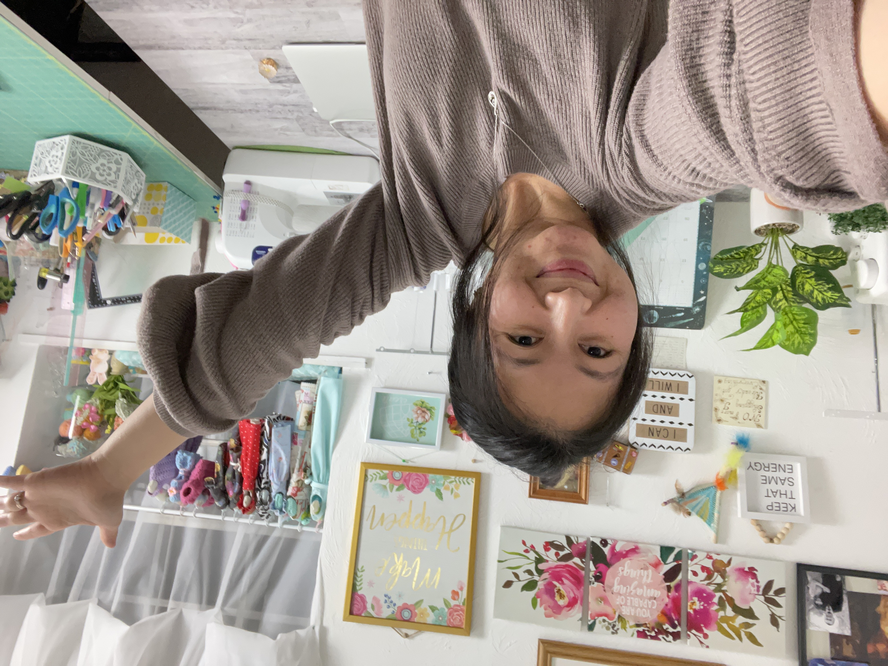

Bankky es una de mis amigas más queridas acá en Ithaca, NY.

La conocí hace algunos años y rápidamente me sorprendió su actitud positiva ante la vida y su tremenda creatividad.

Aquí hay 10 preguntas para la que la conozcan:

***1. ¿Cómo te describirías a ti misma?***

Mi nombre es Bankky. Soy hija, hermana, esposa y madre de cuatro hijos/as increíbles. Nací y crecí en Tailandia. Estoy casada con un japonés y ahora vivo en Ithaca, NY.

***2. ¿Qué quieres de la vida?***

Quiero aprender sobre mí misma. Quiero descubrir lo que puedo hacer y lo que me gusta, descubrir qué me hace feliz, así como probar cosas nuevas. Quiero disfrutar de la vida que he creado con mi familia y ver crecer a mis hijos/as, verlos elegir sus propios caminos y apoyarlos. Quiero ayudar a la gente compartiendo lo que sé. Espero que pueda inspirarlos.

***3. ¿Por qué haces las cosas que haces?***

Me hace feliz y creo que se supone que la vida debe sentirse bien.

***4. ¿Cómo entiendes el proceso de "¿qué pasa si digo que sí?”***

Mi proceso de “¿qué pasa si digo que sí?" es tomar primero la decisión de lo que quiero hacer. Entonces, simplemente voy y lo hago. El último paso y el más importante es ignorar a los detractores.

***5. ¿Cuál dirías que fue tu primer momento de "¿qué pasa si digo que sí?"***

Mi primer momento de "¿qué pasa si digo que sí?" fue cuando decidí tener una hija a la edad de 18 años en contra de la voluntad de mis padres. Esta fue la primera vez que tomé una decisión importante para mí, por mí misma.

***6. Describe tu momento más reciente de "¿qué pasa si digo que sí?".***

Mi más reciente momento de "¿qué pasa si digo que sí?" fue decidir que quería aprender a tocar el ukelele. Han pasado seis meses desde entonces, y he progresado mucho. En el camino, también he descubierto que tocar el ukelele es una de las muchas cosas que me hacen feliz.

***7. ¿Qué cosas has creado en tu vida después de haber dicho "¿y si digo que sí?” Haz una lista.***

Una familia, innumerables proyectos de costura, ganchillo, tejido, muebles y juguetes de cartón, carpintería, comida de juego hecha de fieltro, un canal de YouTube, hacer patrones imprimibles, la habilidad de usar Photoshop, diseño 3D, aprender a cocinar y el último proyecto de ganchillo: un cárdigan grueso para mi hija.

***8. ¿Cómo han reaccionado los demás a tu proceso de "¿y qué pasa si digo que sí?”***

Realmente no presto atención a lo que la gente piensa sobre lo que hago.

***9. ¿Cuál será tu próximo momento de “¿y qué pasa si digo que sí?”***

Por ahora, no lo sé, pero cuando llegue el momento, sabré exactamente qué hacer.

***10. ¿Qué has aprendido del proceso "¿y qué pasa si digo que sí"?***

He aprendido que la vida es tuya, así que haz lo que sea que te haga feliz.

Puedes encontrar a Bankky en:

[Youtube](https://www.youtube.com/c/HappyBankkyCraftyMom)

[Instagram](https://www.instagram.com/happybankkycraftymom/?hl=en)

[Facebook](https://www.facebook.com/HappyBankkyCraftymom/)

[Website](https://www.happybankkycraftymom.com/)
