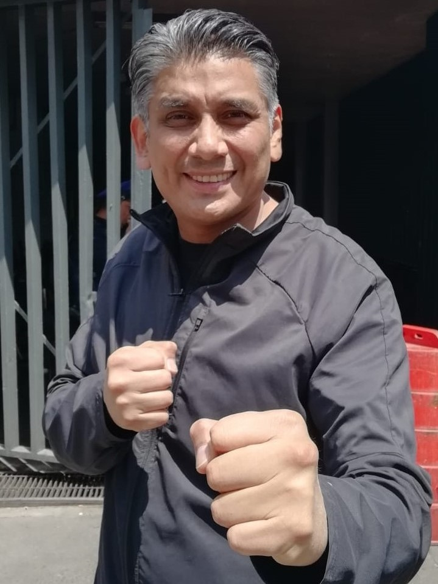
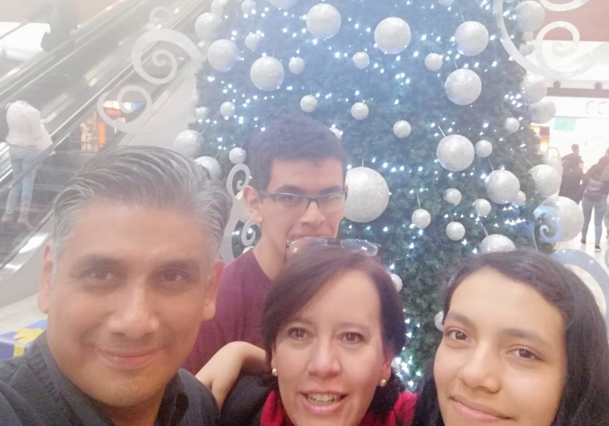
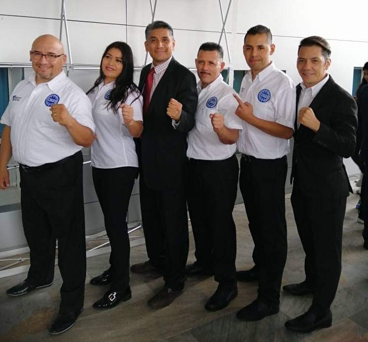

Beto es mi cuñado y mi compadre (soy madrina de Bernardo, su primer hijo), pero lo más importante es que es el hombre al que mi adorada hermana escogió como su pareja de vida.

Lo he querido mucho desde el principio, pero durante todos estos años que llevo de conocerlo he aprendido también a admirarlo porque en un país como México no es algo fácil negociar con tu pareja el revertir los papeles tradicionales de tal manera que mi hermana es desde hace rato la que sale a trabajar (con paga) y él se queda a cuidar a mi sobrino Berni y mi sobrina Rebe (trabajo sin paga).

Durante estos años él ha ido forjando su propio camino (ya lo descubrirán aquí abajo) y eso es siempre una maravilla.

Aquí les dejo las respuestas que Beto me mandó a mis 10 preguntas:

***1. ¿Cómo te describirías a ti mismo?***

Soy un soñador, me gusta soñar. Sueño mientras duermo y sueño mientras estoy despierto. Todo el tiempo estoy soñando: imaginando cosas, haciendo planes, haciendo historias, anticipándome, construyendo el futuro.

Me gusta y disfruto mucho ayudar a que los demás logren sus sueños, no voy por la vida buscando a quien ayudar, pero cuando me cruzo con alguien que necesita un empujoncito, una palmada, una sonrisa o simplemente ser escuchado, lo hago.

Soy un soñador que gusta de ayudar y escuchar a otros.

***2. ¿Qué quieres de la vida?***

Seguir soñando.

***3. ¿Por qué haces las cosas que haces?***

Disfruto lo que hago.

Sé que gran parte de mis actividades afectan de manera positiva los esfuerzos y sueños de alguien más y eso me motiva.
  
***4. ¿Cómo entiendes el proceso de "¿y si digo que sí?”***

Para mí es hacer lo que quieres, atreverte a salir de tu zona de confort y vencer miedos u obstáculos; hacer una pausa o un alto en tu camino y decidir ir por la derecha o por la izquierda en vez de seguir de frente; hacer cosas inesperadas; tomar oportunidades; reinventarte.
  
***5. ¿Cuál dirías que fue tu primer momento de "¿y si digo que sí?"***

No sé cuál fue el primero, pero uno que tengo muy presente es cuando decidimos (mi esposa y yo) que cambiaríamos nuestros roles: ella regresaría a ejercer su profesión y yo dejaría la oficina y dedicaría la mayor parte de mi tiempo a nuestros hijos.

***6. Describe tu momento más reciente de "¿y si digo que sí?".***

Mi momento más reciente es una cadena de momentos: hace varios años (tenía yo 38 y ahora tengo 52) mis dos hijos practicaban Karate y Bernardo, mi hijo mayor, expresó que ya no quería seguir.

Me acerqué a su Sensei y le dije que yo practicaría también así que me comprometí y no había aún solicitado permiso en la oficina para salirme temprano dos días a la semana; afortunadamente no me lo negaron y mis hijos siguieron practicando.

Hoy, mi hijo ya fue Campeón Nacional en su categoría en Kickboxing y participó en un campeonato mundial; yo soy Cinta Negra.

Ese momento de decir sí, me llevó a que años después dijera yo sí a dirigir la asociación de kickboxing de la Ciudad de México y posteriormente a ser parte de la Federación Nacional de Kickboxing, donde sigo soñando en formas de hacer que más personas practiquen, ayudar a desarrollar a más campeones y que no sea por falta de recursos que un deportista no logre su objetivo.

***7. ¿Qué cosas has creado en tu vida después de haber dicho "¿y si digo que sí?” Haz una lista.***

Ante todo, satisfacción personal y que alguien más sonría.

***8. ¿Cómo han reaccionado los demás a tu proceso de "¿y si digo que sí?”***

“Y si digo que sí” es un proceso interno, de cada uno, y seguro lo llamamos de manera diferente.

Pero cada vez que me atrevo y logro algo, fluye energía positiva y esta energía provoca reacciones positivas en las personas: empatía, sonrisas, agradecimiento.

¡Puras cosas buenas!
  
***9. ¿Cuál será tu próximo momento de “¿y si digo que sí?”***

No sé, pero lo que sea le diré que sí. ¿Por qué no?
  
***10. ¿Qué has aprendido del proceso "¿y si digo que sí"?***

¡Atrévete! Vale la pena.

Pueden encontrar a Beto en:

[WAKO CDMX](https://www.facebook.com/WAKOCDMX)

[Facebook](https://www.facebook.com/beto.cordova.397)

