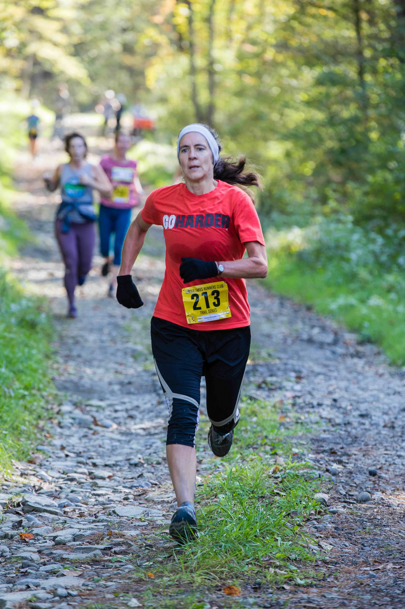
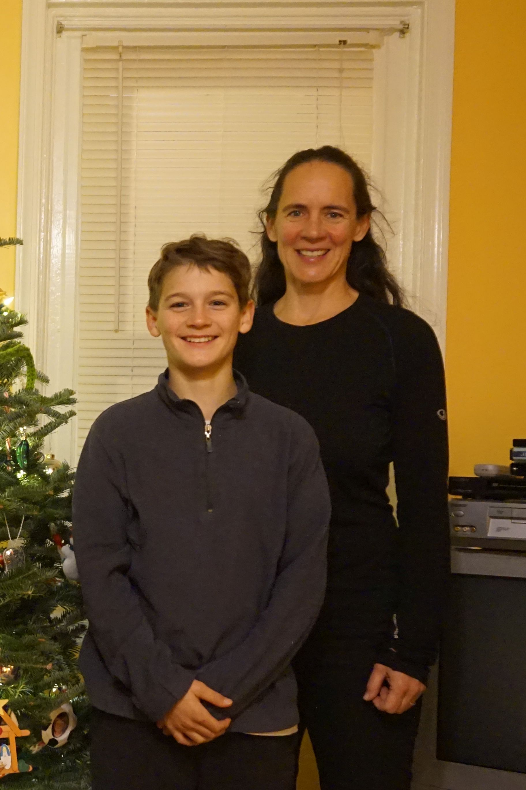

Recién llegada a Ithaca conocí a esta mujer espectacular: Kristen.

Recuerdo que una de las primeras cosas que supe de ella es que estaba educando a sus dos hijos varones en la casa, lo que acá le llaman *homeschooling*. Y eso me dejó con la boca abierta… en buen plan.

Poco a poco me fui enterando del maravilloso camino que Kristen se ha ido forjando en esta vida, no solo para ser feliz ella sino para ayudar a otras personas, en especial, a las que más lo necesitan.

¡Kristen tiene un corazón del tamaño del planeta entero!

Aquí les dejo las respuestas que Kristen me mandó a mis 10 preguntas:

***1. ¿Cómo te describirías a ti misma?***

Soy alguien que tiene dificultades con los "Nos".

Tengo quizás un nivel inusual de confianza en mí misma.

Tengo una idea o decido que quiero aprender a hacer algo y generalmente confío en que puedo lograr un dominio básico.

Tengo mucha energía y soy curiosa.

También me encanta trabajar con las manos y estar al aire libre.

Siempre he gravitado hacia cosas que están fuera de la norma social o son un desafío inusual: trabajar en la construcción como mujer, aprender nuevos idiomas y educar a nuestros hijos en el hogar, por nombrar algunos.

¡Soy alguien que no puede quedarse quieta y siente que nunca hay suficientes horas en el día para lograr todo lo que me hubiera gustado hacer ese día!

***2. ¿Qué quieres de la vida?***

Quiero ser feliz y que todos los que me rodean sean felices. Trato de pasar al menos parte de mi tiempo libre cada semana haciendo algo para hacer del mundo un lugar mejor.

Quiero que la gente me recuerde como alguien que marcó una pequeña diferencia en sus vidas.

Creo que los últimos tres párrafos de este poema de Mary Oliver lo resumen mejor:

>Cuando termine, quiero decir: toda mi vida
>Fui una novia casada con el asombro.
>Yo era el novio, tomando el mundo en mis brazos.

>Cuando termine, no quiero preguntarme
>si he hecho de mi vida algo particular, y real.
>No quiero encontrarme suspirando y asustada,
>o llena de argumentos.

>No quiero terminar simplemente habiendo visitado este mundo.

***3. ¿Por qué haces las cosas que haces?***

He tratado de encontrar un equilibrio en la vida entre hacer cosas para los demás y encontrar tiempo para mí. Me siento muy afortunada de haber podido educar en casa a nuestros dos hijos y de haber tenido trabajos intelectualmente desafiantes.

Me motiva mucho la energía positiva de otras personas, pero no soy muy buena para tratar con las personas cuando están tristes o frustradas.

Trato de ser una fuerza positiva en el mundo y espero que una sonrisa y un acto de bondad puedan marcar la diferencia.
  
***4. ¿Cómo entiendes el proceso de "¿y si digo que sí?”***

Lo que se me hace importante de la carta de Héctor es la importancia de tomar riesgos emocionales. Salir de tu zona de confort y confiar en que todo saldrá bien.

Tener fe en la bondad básica de los demás seres humanos y aprender a apreciar los dones únicos que todos traemos al mundo.

Decir “Sí” es aprender a crear aventuras para ti misma que te obliguen a estar abierta a nuevas ideas y formas de ver el mundo.

Esas aventuras pueden ser tan simples como dar un paseo diferente cada día y saludar a alguien nuevo o tan audaces como cambiar de carrera o hacer un viaje a un lugar donde no hablas el idioma.
  
***5. ¿Cuál dirías que fue tu primer momento de "¿y si digo que sí?"***

Decir “Sí” es creer en ti misma, en algo mágico.

Las niñas y los niños son creyentes naturales en su poder para cambiar el mundo, y doy crédito al apoyo inagotable de mis padres por hacer que esa magia durara mucho tiempo.

Recuerdo estar increíblemente frustrada cuando era niña porque no podían ayudarme a publicar de a de veras el libro que había escrito.

O que la mesa de picnic que había inventado con mis Legos que se convertía de una mesa de patio a una mesa de picnic para dos no podía venderse de inmediato a un fabricante y comercializarse en masa a todos mis conocidos.

Solía ​​pensar: “¿Por qué estos adultos no veían las posibilidades del “Sí” en mis ideas?”

***6. Describe tu momento más reciente de "¿y si digo que sí?".***

Mis momentos más recientes de "¿Y si digo que sí?" han sido sobre escuchar.

¿Y si simplemente disminuyo la velocidad y paso tiempo con amigas/os escuchando, realmente escuchándolas/os?

Para alguien que está constantemente en movimiento, decir "Sí" ha significado aprender mejor cómo vivir el momento y estar presente con otras personas.

También soy muy reacia a los conflictos. Tengo una gran alerta de "No" que aparece en mi cerebro cuando existe la posibilidad de un conflicto.

Entonces, confrontar emociones duras con mi familia también ha sido un momento de “Sí”.

***7. ¿Qué cosas has creado en tu vida después de haber dicho "¿y si digo que sí?” Haz una lista.***

- ¡Una hermosa familia!
- Viviendas para familias al trabajar para Hábitat para la Humanidad
- Nuevas amistades alrededor del mundo
- Un cobertizo en el patio trasero del que estoy orgullosa
- Dibujos y un autorretrato muy enojada

***8. ¿Cómo han reaccionado los demás a tu proceso de "¿y si digo que sí?”***

La mayoría de la gente reacciona positivamente.
  
***9. ¿Cuál será tu próximo momento de “¿y si digo que sí?”***

Si pudiera predecirlo, no siento que sería un verdadero momento de "¿Y si digo que sí?"

Pero si lo medito un poco, creo que la decisión que Isaiah y yo tomamos de comenzar juntos las lecciones de árabe es nuestra próxima aventura de "¿Y si digo que sí?"

Ya hemos conocido gente nueva y aprendido muchos hechos culturales nuevos además del idioma en sí.

¡Me encanta el hecho de que aprender otro idioma literalmente te da la posibilidad de conocer y conectarte con millones de personas más en nuestro gran mundo!
  
***10. ¿Qué has aprendido del proceso "¿y si digo que sí"?***

Lo que aprendí del proceso “¿Y si digo que sí?” es que no todos están tan abiertos a algunas ideas como yo.

Y tengo que tener cuidado de no lastimar a las personas que amo con demasiados "Sí".

Si usas la analogía de Héctor de que un “Sí” es la expansión de tu cerca personal para incluir un nuevo espacio, no vivimos en un mundo de espacio infinito.

A veces, mi expansión de una cerca puede infringir el espacio seguro de otra persona.

De eso debo tener más cuidado.

