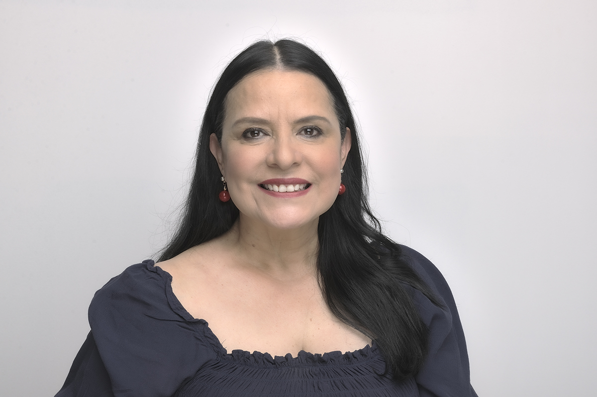
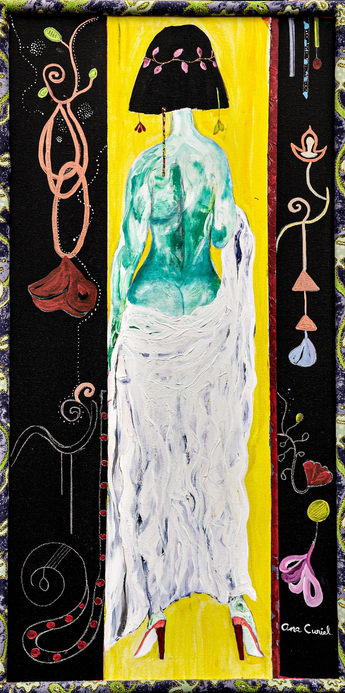
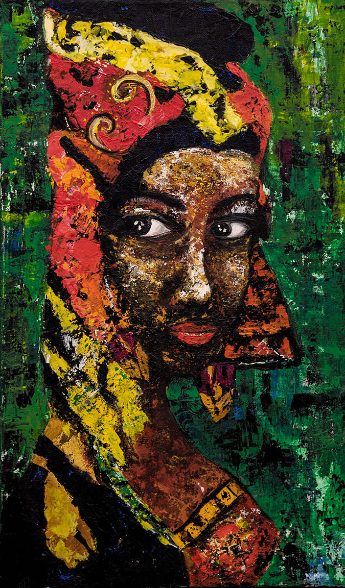

Ana Laura (yo la llamo Aniux) estuvo casada con mi hermano mayor, pero yo la sigo llamando cuñada :)

Quise que fuera la “Persona *¿Y si digo que sí?*” de este mes porque ella nació en marzo. Esto es como mi regalo de cumpleaños para ella.

Aquí hay 10 preguntas que le hice para que la conozcan mejor:

***1. ¿Cómo te describirías a ti misma?***

Cuando era niña, recuerdo que en el patio de mi casa había una escalera de madera que siempre estaba recargada en la pared, nadie la usaba porque decían que ya estaba viejita, además, nos podíamos caer y lastimar. Yo solía subir y no me daba miedo, me decían que la escalera no me llevaría a ninguna parte, aunque, yo sentía que tocaba el cielo con las manos; soñaba con otros mundos. Ahora entiendo que ha sido un ejercicio de vida y que mis sueños han servido para realizarlos, para ser yo.

“¡Ana por la ventana!” Así me dijeron por algún tiempo ya que tengo por costumbre observar a las personas, me da curiosidad imaginar su mundo. Eso en algunas ocasiones me da la oportunidad de recrearlas cuando tengo que interpretar un personaje.

Hace pocos años descubrí los salones de baile, algunos tienen más de 80 años de existir. Asisto a ellos y mi arreglo personal es todo un ritual, desde que me estoy maquillando ya me esperan los zapatos apropiados, son de tela y tacón para bailarinas profesionales, luzco accesorios brillantes y grandes. Al llegar al Salón percibo la sensación de entrar a otra época, algo así como una película. Soy una de las mejores bailarinas de Danzón en México. La música acompaña mis movimientos y el vaivén provoca el juego de mis vestidos de vuelos, flequillos y texturas.

Algo que llama mi atención es que cuando llego a una reunión ya sea de pintores, escritores o amigas de otros ambientes. La gente se pone feliz porque ya llegué, me dicen que armonizo la energía, que mi alegría contagia, pero por sobre todas las cosas, porque han aprendido mucho de mí, dicen que soy un ejemplo de vida y cuando pregunto por qué, me contestan que porque ven a una mujer fuerte, resiliente, imparable y exitosa. Me hacen sentir muy bien cuando me lo hacen saber con sus palabras.

No ha sido fácil. ¿Sabes?

He cometido errores, algunos marcaron mi vida y me arrepiento. Sí, he tropezado muchas veces y me he tenido que reinventar porque como ya sabes, creo en el poder de los sueños, las metas y el perdón.

Hace poco tiempo, mientras me desmaquillaba frente al espejo, descubrí a la que soy, me sorprendió y me gustó a la mujer que vi en mí y me dije: “Sí, esta soy, así me acepto.”

A partir de ese día, hay una conciencia de mi personalidad y te puedo decir que me llevo bien conmigo, me quiero, me caigo bien y he aprendido a recibir a la persona que soy.

Me amo, amo mi vida y lo que más amo en ella, es a mi hijo Luis a quien admiro y respeto. Cuando estoy con él soy muy feliz.

***2. ¿Qué quieres de la vida?***

Dar tanto como he recibido. Disfrutarla como la melodía más gozosa, el libro más sorprendente y la compañía más amorosa. Seguir deleitándome de las conversaciones y enseñanzas de mi hijo Luis. Amar y ser amada.

***3. ¿Por qué haces las cosas que haces?***

Recuerdo que un día viendo uno de mis programas favoritos en la televisión, me detuve a observar en especial a una conductora quién articulaba muy bien las palabras y denotaba conocimiento cultural y me pregunté: “¿Y si yo fuera esa señorita?”

En ese entonces vivía en una zona muy lejana a las mejores escuelas de teatro, pero, aun así, me inscribí en una, pasó un tiempo y en una clase, la maestra me preguntó que si quería ir a un casting, porque buscaban a una conductora de televisión.

¿Adivinen para qué programa? ¡Sí! Para mi programa cultural favorito.

Me volví a preguntar: “¿Y qué pasa si digo que sí?”

Fui a Televisa, pasé pruebas muy difíciles y quedé aceptada, además, me hicieron titular de otro programa de música clásica.

Así fui entendiendo que la escalera no se mueve si nosotros no avanzamos, que el miedo es pobreza, ignorancia, inseguridad y falta de fe.

Hoy en día todavía he seguido como conductora de varios programas culturales y actualmente soy conductora invitada de un programa importante de UNAM.

Aquí va una lista de las cosas que he hecho después de haberme hecho la pregunta:

¿Y qué pasa si digo que sí y acepto la aventura de ir por tierra y manejando a Alaska?

¿Y si después acepto ir a otro viaje a la Antártida y también por tierra?

¿Y si voy a París a estudiar un Taller de perfeccionamiento actoral con el Théâtre du Soleil?

¿Y si creo mi empresa como Coach?

¿Y si ofrezco mis servicios de conferencista por la experiencia adquirida con TV Azteca dando conferencias en la República Mexicana apoyando a mujeres?

¿Qué pasa sí entro a la Universidad de Londres y les digo que quiero dar clases ahí?

¿Y qué pasa si hago casting para grabar con Discovery Chanel como locutora?

Recuerdo que un día mi mamá me dijo: “Cuando algo te dé miedo, repite estas palabras: YO SOY, YO SÉ, YO PUEDO.” Así titulé una de mis conferencias.

Lo que pasa es que hago un ejercicio de confianza.

¿Sabes qué es lo que pasa?

Pasa que me doy cuenta de mis alcances, lo logro, simplemente, avanzo un escalón más y vuelvo a tocar el cielo con mis manos. Lo hago porque estoy viva y porque creo que estamos aquí por una misión y mi misión es vivir, lo maravillosa que es la vida.

***4. ¿Cómo entiendes el proceso de "¿qué pasa si digo que sí?”***

Mira, si ya pasó por mi mente hacer algo porque lo deseo o porque me va a hacer feliz o quizá porque creo que lo merezco o por todas esas razones, entonces sólo queda hacerlo.

Lo entiendo como una decisión que hay que tomar, como la oportunidad de descubrirme recibiendo el sí.

Además, es de valientes dar el paso. ¡Felicítate!

¿Recuerdas que cuando era niña me decían que, si subía por esa escalera, me lastimaría y me dolería? Efectivamente, caerse duele, pero se crece y finalmente, crecer también duele.

***5. ¿Cuál dirías que fue tu primer momento de "¿qué pasa si digo que sí?"***

Cuando decidí dejar la casa de mis padres para encontrar lo que buscaba. Yo quería ser actriz, ya estaba estudiando, pero la distancia era desfavorecedora. Fue muy difícil, pero ahí comencé una historia.

La historia de mi profesión de actriz con 35 años de carrera artística.

***6. Describe tu momento más reciente de "¿qué pasa si digo que sí?".***

Como actriz, constantemente paso por momentos de “¿Qué pasa si digo que sí?”

El más reciente fue hace pocos días, cuando estaba negociando para trabajar en una película.

Por un lado, era el presupuesto que no me convencía y por el otro era que había una promesa de mejorarlo según se fueran dando las circunstancias, pero esa promesa no iba a ser firmada, sólo era de palabra.

Tuve la duda de aceptar, finalmente dije que sí. En este momento sigo filmando. ¡Cumplieron su promesa!

***7. ¿Qué cosas has creado en tu vida después de haber dicho "¿y si digo que sí?” Haz una lista.***

El haber tomado la decisión de buscar una vida diferente a la que tuve en mi infancia.

El haber conocido a personas maravillosas que dejaron huella en mí y grandes aprendizajes llenos de amor.

El haber tenido a mi hijo Luis.

Una enorme fortaleza de confianza en mí.

El haber sabido esperar a que viniera otra oportunidad.

El no haber forzado las cosas ni a las personas porque para todo hay un tiempo.

El haberme confrontado con mi ego.

***8. ¿Cómo han reaccionado los demás a tu proceso de "¿y qué pasa si digo que sí?”***

En general me he rodeado de gente maravillosa, me alientan, preguntan cómo pueden apoyar, hacen recomendaciones; otras veces, de forma empática me cuentan anécdotas de lo que a ellos les ha funcionado.

He ido aprendiendo de la gente que ha rodeado mi vida, la mayoría de las veces de formas amorosas, con cariño y lo agradezco mucho.

***9. ¿Cuál será tu próximo momento de “¿y qué pasa si digo que sí?”***

Hacer otra carrera universitaria. Hoy en día sigo estudiando y perfeccionándome. Considero que soy competente y tengo las capacidades y habilidades para realizar los cargos y trabajos que desempeño; pero, quiero tener mi título en la licenciatura en Actuación o Arte dramático.

***10. ¿Qué has aprendido del proceso "¿y qué pasa si digo que sí"?***

Que debo confiar en la magia, mi poder mental, el amor y seguir siendo agradecida.

Que debo creer en mí. Que después de la montaña puede estar el paraíso. Que la vida tiene un sinfín de posibilidades. Y que debo disfrutar los procesos de la toma de decisiones.

Pueden encontrar a Ana Laura en:

[Website](https://www.analauraespinosa.net/)

[Instagram](https://www.instagram.com/ana9lauraespinosa/)

[Facebook](https://www.facebook.com/ana.l.espinosa.9/)

[YouTube](https://www.youtube.com/channel/UCLGTZH0kpx3Am0Xt-IjrQGw)
