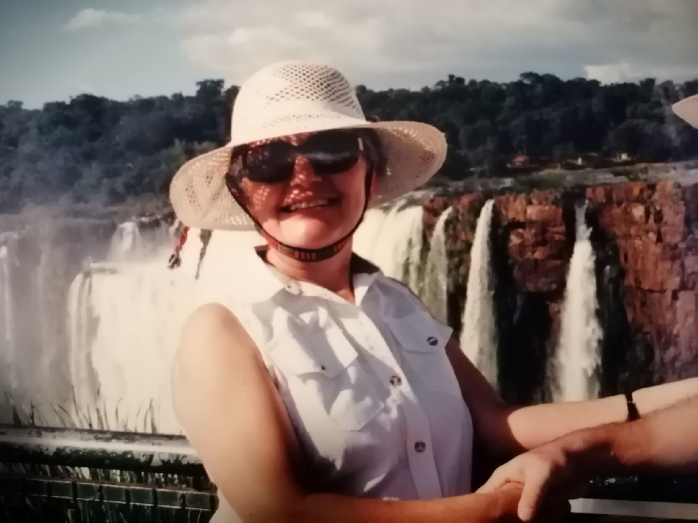
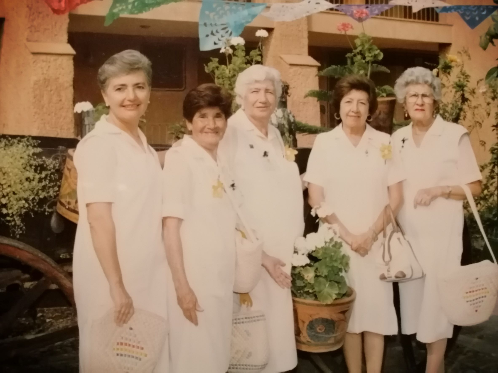
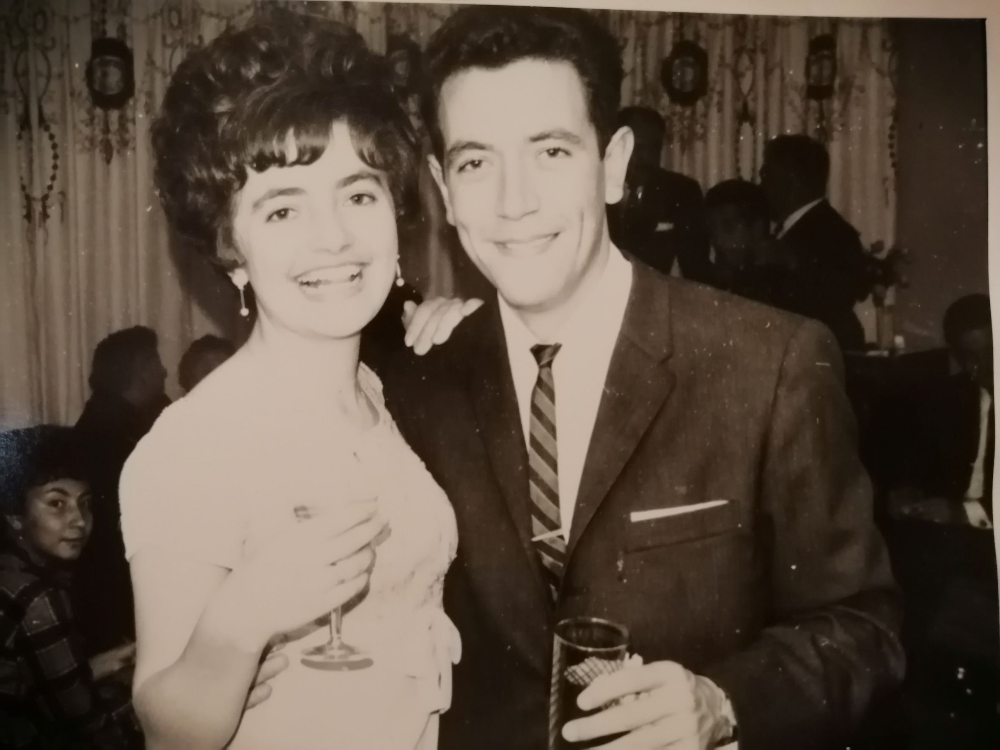
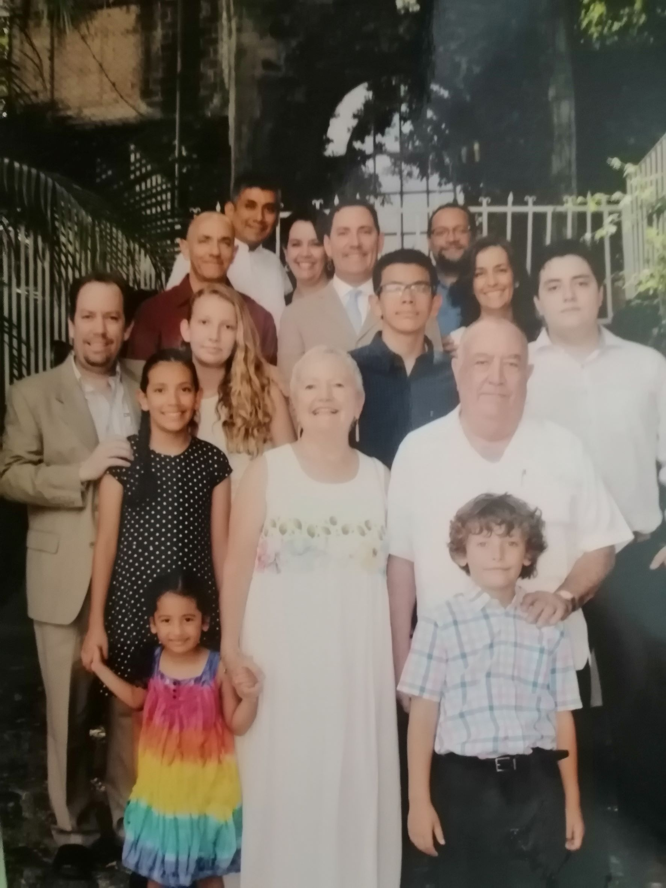

A mi mamá la describí en un texto que le regalé hace muchos años como “la fuerza que lo une todo”.

Tuvo con mi papá 3 hijos y 2 hijas antes de cumplir 30 años y durante todos estos años nos ha criado, querido, aconsejado, guiado a nosotras y nosotros y a sus 3 nietos y 3 nietas.

Es una mujer imparable y con un gran corazón.

Y aunque por fuera parecería que ha vivido una vida muy tradicional (una mujer dedicada al hogar y a su familia), su vida no tiene nada de tradicional. Ha hecho lo que ha querido cuando lo ha querido. Nada lo ha hecho por imposición.

Aquí hay 10 preguntas que le hice para que la conozcan mejor:

***1. ¿Cómo te describirías a ti misma?***

Como una persona sensible, con mucha empatía, que ama por sobre todo a su familia, interesada en la cultura, muy buena escucha y dispuesta a experimentar nuevos retos.

***2. ¿Qué quieres de la vida?***

Que mi familia y yo tengamos salud y que podamos realizar lo que nos interese.

***3. ¿Por qué haces las cosas que haces?***

Porque las siento mi responsabilidad o porque me gustan.

***4. ¿Cómo entiendes el proceso de "¿y si digo que sí?”***

Lo entiendo como la aceptación de un reto.

***5. ¿Cuál dirías que fue tu primer momento de "¿y si digo que sí?"***

Lo primero que me viene a la mente es cuando acepté ser novia de el que ahora es mi esposo, hace 58 años.

***6. Describe tu momento más reciente de "¿y si digo que sí?".***

Si no el más reciente, sí uno que considero muy importante y es cuando acepté tomar el curso para ingresar al grupo de Voluntarias del Instituto Mexicano del Seguro Social (IMSS).

***7. ¿Qué cosas has creado en tu vida después de haber dicho "¿y si digo que sí?” Haz una lista.***

Grandes satisfacciones como Voluntaria del IMSS

Buenas relaciones con mi familia.

Buenas relaciones con mis amistades.

***8. ¿Cómo han reaccionado los demás a tu proceso de "¿y si digo que sí?”***

Apoyándome.

***9. ¿Cuál será tu próximo momento de “¿y si digo que sí?”***

Acaba de suceder:

Mi nieto y su novia tienen cada uno una perrita.

Para que nos visiten en Cuernavaca, las tienen que traer porque no tienen con quién dejarlas.

Si se quieren quedar a dormir, yo solo tengo una recámara disponible, pero tiene alfombra y yo no quería que las perritas entraran ahí.

Finalmente me pareció más importante la relación con mi nieto que la alfombra y dije que sí podían venir con sus perritas y quedarse en la recámara con ellas.

No pasó nada grave y todos la pasamos muy contentos.

***10. ¿Qué has aprendido del proceso "¿y si digo que sí"?***

 Que siempre es un reto y una posibilidad de aprendizaje sea cual sea el resultado.

